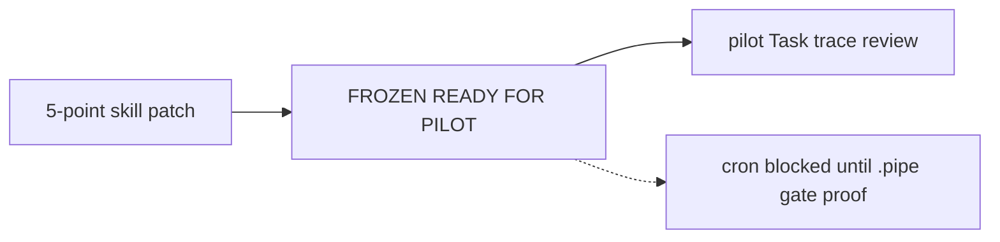

# Доработка action-execution (release review)

Источник: [docs/action-execution-release-review.md](docs/action-execution-release-review.md). Вердикт: **APPROVE AFTER SMALL PATCH**.

## Scope

Только:

- [skills/autonomous-ai-agents/action-execution/SKILL.md](skills/autonomous-ai-agents/action-execution/SKILL.md)
- [skills/autonomous-ai-agents/action-execution/references/workflow.md](skills/autonomous-ai-agents/action-execution/references/workflow.md)
- [skills/autonomous-ai-agents/action-execution/references/invariants.md](skills/autonomous-ai-agents/action-execution/references/invariants.md)

Язык: English. Архитектуру / роли / FAIL semantics / orphan / provenance / Cursor permissions **не менять**. Bump `version: 0.5.0` → `0.5.1`.

**Вне scope:** поиск/clone/правка `.pipe`, реализация production gates, cron enable, SOUL/config, docs review-файлы, дополнительные архитектурные предложения.

---

## 1. `.pipe` — pinned external subrepo, не обязательный submodule

Сейчас жёстко «submodule»:

- `SKILL.md` Prerequisites: `(submodule; implement in source .pipe…)`
- `workflow.md` §task_gate deployment: `consumed … as a submodule`
- `invariants.md` External `.pipe` contract: `as a submodule at …`

Заменить во всех трёх на контракт:

```text
Product repo consumes a pinned revision of the external `.pipe` repository
at `.pipe/`. The attachment mechanism is outside this skill.
```

Путь гейтов без изменений: `.pipe/aidesklab-factory-gates/{…}`. Слово `submodule` не использовать как обязательный механизм.

---

## 2. Overlay security для `test_files` / `support_files`

Сейчас security boundary описан для Target file; overlay paths — только «repo-relative / never production implementation».

Добавить **до Task Gate** mechanical validation каждого пути в `test_files` и `support_files`:

```text
canonical repo-relative
no ..
not absolute
no symlink escape outside repo
not .pipe/**
not .git/**
not secret / credential path
inside repo-defined test / fixture boundaries
Target file текущего production Action ≠ overlay path
неклассифицируемый путь → Task FAIL
```

Где править:

- `workflow.md`: рядом с Target в Dynamic input / Verification schema + перед overlay algorithm (§10)
- `invariants.md`: таблица FAIL + секция Dynamic input validation — `test_files`/`support_files` рядом с Target
- `SKILL.md`: Quick Reference Inputs / Target / Pitfalls — краткая отсылка к overlay boundary

Не выполнять overlay «по доверию к тексту задачи».

---

## 3. Expanded 10-case gate suite

Везде заменить `8-case` / `8-case suite` / `8-case contract` на **expanded 10-case gate suite**.

Текущий список в `workflow.md` §«8-case contract» расширить двумя кейсами из review:

```text
9. overlay path → production / .pipe / secret / traversal / symlink escape / outside repo
   → gate FAIL
10. production Task Gate exposes only legacy shell-interpreted --acceptance-cmd
   → deployment preflight BLOCK
```

Кейсы 1–8 оставить как есть (формулировки из review). Обновить упоминания в:

- `SKILL.md` Prerequisites + Quick Reference Task Gate
- `workflow.md` deployment checklist + заголовок/тело suite
- `invariants.md` External `.pipe` contract + Prohibitions (`8-case` → `10-case`)

Cron по-прежнему **blocked** до доказательства suite на production `task_gate.sh`.

---

## 4. Fresh remote Outcome fetch перед drift / Task Gate

Сейчас: `Outcome tip != outcome_base_sha → Task FAIL`, но без явного re-fetch перед check (fetch есть только в начале branch policy).

В `workflow.md` **непосредственно перед** §9b provenance / §10 Task Gate добавить:

```text
git fetch <validated-remote>
```

Затем сравнивать:

```text
refs/remotes/<remote>/<outcome_branch>  ==  pinned outcome_base_sha
```

Remote drift → Task `To Do` + `FAIL`; no auto-rebase/merge.

Инвариант drift:

```text
fresh remote Outcome tip == pinned outcome_base_sha
```

Зеркально в `SKILL.md` (How to Run / Procedure §4 / Quick Reference Drift) и `invariants.md` (Outcome drift).

---

## 5. Cleanup temp Action prompt после Cursor

В `workflow.md` после §5.4 Cursor (и в Action loop): удалить

```text
/tmp/aidesklab-actions/<task-id>/<action-id>.md
```

независимо от PASS/FAIL Cursor, если файл был создан. Не влияет на Git recovery evidence.

Кратко в `SKILL.md` How to Run / Pitfalls. В `invariants.md` — в prohibitions или рядом с prompt-files (не оставлять prompt на runner бессрочно).

---

## Согласованность и freeze checklist

После правок проверить, что три файла говорят одно и то же по пяти пунктам. Definition of Freeze из review:

```text
[ ] .pipe = external pinned subrepo (не обязательный submodule)
[ ] test_files/support_files = overlay security boundary
[ ] documented gate suite = 10 cases
[ ] remote Outcome re-fetch перед drift / Task Gate
[ ] temp Action prompt cleanup после Cursor
[ ] cron всё ещё blocked до production gate proof
```

В финальном ответе: подтвердить пять изменений; **не** предлагать новые архитектурные доработки skill; следующий review — pilot Task trace / Git / Kaneo / gate logs / PR.


