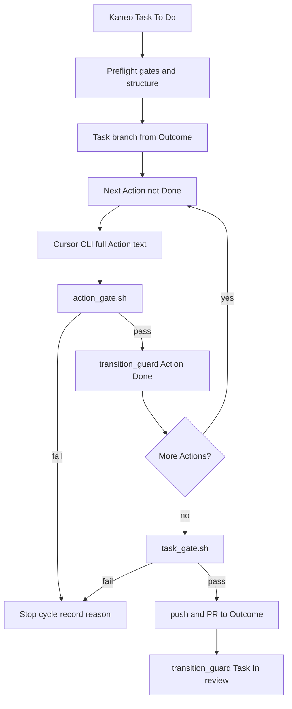

# Skill action-execution для skills/

## Цель

Превратить [docs/SKILL_action-execution_devJunior.md](docs/SKILL_action-execution_devJunior.md) в рабочий Hermes skill под [skills/](skills/), чтобы `devJunior` загружал процедуру выполнения Kaneo Task (Action → Cursor → gates → PR → In review).

## Размещение

- Путь: [`skills/autonomous-ai-agents/action-execution/`](skills/autonomous-ai-agents/)
- Почему эта категория: DESCRIPTION категории — оркестрация autonomous coding agents; рядом уже `codex`, `opencode`, `merge-reconciler`.
- Документ в `docs/` не удалять и не дублировать один в один как единственный файл — он остаётся исходной спецификацией.

## Структура файлов

```text
skills/autonomous-ai-agents/action-execution/
├── SKILL.md
└── references/
    ├── workflow.md          # полный алгоритм §1–16 из docs
    ├── invariants.md        # запреты, failure policy, DoD, главный инвариант §17–21
```

`SKILL.md` — операционный каркас (~150–200 строк): триггеры, prerequisites, цикл Action, команды gates, критерий завершения. Детали и длинные списки — в `references/`, со ссылками из тела.

## Frontmatter (Hermes hardline)

Как в [hermes-agent-skill-authoring](skills/software-development/hermes-agent-skill-authoring/SKILL.md):

```yaml
---
name: action-execution
description: "Run Kaneo Task Actions via Cursor and gates."
version: 0.1.0
author: AIDeskLab, Hermes Agent
license: MIT
platforms: [linux, macos, windows]
metadata:
  hermes:
    tags: [Kaneo, Cursor, Action, Task, Gates, PR]
    related_skills: [codex]
---
```

`description` ≤ 60 символов (capability, не копипаст длинного YAML из docs).

## Содержание SKILL.md (обязательные секции)

1. **Intro** — роли: `devJunior` оркестрирует, `Cursor` единственный пишет production-код; инвариант `1 Action = 1 file = 1 commit`.
2. **When to Use** — Kaneo Task (`label: Task`, `To Do`, assignee `devJunior`); дерево Outcome → Task → Actions. Don't use: нет `.pipe` gates, нарушена иерархия, merge/review (это `devMaster`).
3. **Prerequisites** — production repo + `.pipe/aidesklab-factory-gates/{action_gate.sh,task_gate.sh,transition_guard.py}`, `make verify-fast`, MCP Kaneo, Cursor CLI (`cursor agent`, `--model auto`).
4. **How to Run / Quick Reference** — канонические команды через `terminal`:
   - baseline: `BEFORE_SHA="$(git rev-parse HEAD)"`
   - Cursor: передать **полный текст Action без пересказа** (`cursor agent --model auto ...`)
   - Action Gate / Task Gate / `transition_guard.py` — как в docs §7, §9, §11, §15
5. **Procedure** — сжатые шаги с completion criteria:
   - intake + preflight
   - Outcome/Task branch (clean WT; не main/Outcome)
   - последовательный цикл Action → Cursor → Action Gate → Done
   - Task Gate → push → PR Task→Outcome → Task In review
   - rework после review changes (§16)
6. **Pitfalls** — не чинить код Cursor вручную; exit code gates = истина; идемпотентность; конфликт Kaneo↔Git → stop.
7. **Verification** — Definition of Done из §20.

Язык тела: **русский**, как в исходном docs и в SOUL (технические термины на английском).

## Что сознательно не делать

- Не тащить kanban-оркестратор / Codex-default из devMaster.
- Не добавлять scripts/ (гейты живут в `.pipe` целевого репо).
- Не писать отдельные pytest (у соседних procedure-skills вроде `merge-reconciler` тестов нет; скриптов у skill нет).
- Не менять [SOUL.md](SOUL.md) / [config.yaml](config.yaml) в этом шаге — только skill; при желании отдельным коммитом можно добавить ссылку на skill в `coding_instructions`.

## Поток (кратко)


