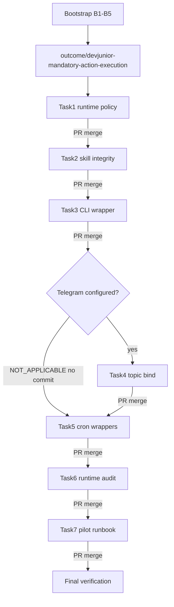

# План: обязательный routing `action-execution` для devJunior

Источник истины: [docs/devjunior-config-mandatory-skill-implementation-plan.md](docs/devjunior-config-mandatory-skill-implementation-plan.md). Этот план — исполняемая последовательность; формулировки YAML, prompt, commit messages и маркеры SOUL брать **verbatim** из исходника.

## Outcome

Любой Kaneo Task исполняется только в session, где `action-execution` предзагружен до первого model turn.

Разрешённые entrypoints: Cron (skill-backed job), Telegram (skill-bound topic), CLI (`scripts/devjunior-task.sh`). Запрещён: bare `devJunior` session, где модель сама решает читать skill.

## Инварианты исполнителя (стоп-правила)

1. Tasks строго по порядку. Следующий Task — только после merge предыдущего PR в Outcome.
2. Каждый Task = отдельная branch от актуальной Outcome + PR Task → Outcome.
3. Каждый Action меняет/создаёт **ровно один файл** и заканчивается **ровно одним commit**. Не объединять Actions.
4. Не менять `skills/autonomous-ai-agents/action-execution/` (`SKILL.md`, `workflow.md`, `invariants.md`).
5. Не искать, не clone'ить, не менять `.pipe`. Не менять Hermes source. Не писать `~/.hermes/cron/jobs.json`. Не трогать `.env`, credentials, product repos.
6. Не придумывать model / provider / chat_id / product paths. Значения только из существующей конфигурации (Bootstrap B5).
7. Verification Action провален → **STOP**, следующий Action не начинать.

Среда: скрипты — `bash` (`#!/usr/bin/env bash`). На Windows выполнять через Git Bash / WSL, не PowerShell как runtime скриптов.

---

## Текущее состояние репозитория (входные факты)

`PROFILE_ROOT` ожидается как корень этого repo: здесь одновременно есть [config.yaml](config.yaml) и [SOUL.md](SOUL.md). Canonical package: [skills/autonomous-ai-agents/action-execution/SKILL.md](skills/autonomous-ai-agents/action-execution/SKILL.md) (`name: action-execution`, `version: 0.5.1`) + `references/workflow.md` + `references/invariants.md`. Других `name: action-execution` в repo нет.

Расхождения `config.yaml` vs Task 1 (сохранить всё unrelated):

- `skills.external_dirs` сейчас только `/opt/aidesklab/agent-skills` — **сохранить**, добавить `ACTION_EXECUTION_SKILLS_ROOT` один раз, если это другой path.
- `skills.project_discovery` — отсутствует → `false`.
- `agent.tool_use_enforcement: auto` → `true`; `agent.execution_guidance` отсутствует → `true`.
- `tool_loop_guardrails.hard_stop_enabled` уже `true`, но пороги другие: `warn_after.same_tool_failure` 2→3; `hard_stop_after.exact_failure` 4→5; `same_tool_failure` 5→8; `idempotent_no_progress` 4→5. Блок `loop_caps` **не трогать**.
- секции `cron:` нет → добавить `preflight/model_drift_guard/allow_agent_scheduling`.
- `approvals.mode: smart` и `approvals.cron_mode: deny` уже верны.
- Telegram: есть top-level `telegram.require_mention`, **нет** `chat_id` / `platforms.telegram.extra`. Task 4 решается только по B5, не по догадке.
- [SOUL.md](SOUL.md) **не содержит** `TASK EXECUTION POLICY` (есть старый «Task intake», который разрешает generic execution). Action 1.2 только **append**, старый текст не переписывать.

Ещё нет: `skills.lock`, `scripts/*.sh`, `docs/devjunior-task-routing-pilot.md`. Нет CI/Makefile deploy — механизм деплоя фиксировать в Bootstrap, не выдумывать.

**Жёсткий gate до Outcome branch:** package `action-execution` в git status был untracked. Разрешённый diff Outcome vs base **не включает** эти три файла. Если на base/HEAD их нет — **STOP**: сначала отдельным процессом (вне этого плана) посадить v0.5.1 на base. Этот workstream их не коммитит и не патчит.

---

## Фаза 0 — Bootstrap (inspection only, без commit)

Выполнить до создания любой branch. Ничего не менять.

### B1. Repository root

```bash
git rev-parse --show-toplevel
```

Сохранить как `REPO_ROOT`.

### B2. Profile root

Найти ровно одну директорию с парой `config.yaml` + `SOUL.md`. Сохранить `PROFILE_ROOT`. 0 или >1 → **STOP**.

Ожидание: `PROFILE_ROOT == REPO_ROOT`.

### B3. Canonical action-execution

Найти ровно один package с `name: action-execution` и `version: 0.5.1`, внутри которого есть `SKILL.md`, `references/workflow.md`, `references/invariants.md`.

Сохранить:

- `ACTION_EXECUTION_DIR` — корень package
- `ACTION_EXECUTION_SKILLS_ROOT` — каталог, который Hermes сканирует через `skills.external_dirs` (ожидание: `$REPO_ROOT/skills`)
- repo-relative path `REPO_ROOT → ACTION_EXECUTION_DIR` (для lock: `skills/autonomous-ai-agents/action-execution`)

0 или >1 package → **STOP**.

### B4. Hermes profile

```bash
hermes --version
hermes profile show devjunior
hermes -p devjunior skills list
hermes -p devjunior cron status
```

Profile обязан существовать. Сохранить CLI version и факт, виден ли уже `action-execution`.

### B5. Existing runtime values (read-only)

Существующими Hermes CLI/config средствами зафиксировать **без изменения**:

- current devjunior model
- current devjunior provider (`config.yaml`: `nous` / `tencent/hy3` — подтвердить через CLI, не подменять)
- `cron.model` / `cron.model_provider`, если заданы (сейчас в yaml отсутствуют)
- Telegram configured yes/no
- existing authorized Telegram `chat_id`, если configured
- existing cron jobs с именем `devjunior:*`
- existing `skills.external_dirs` (сейчас `/opt/aidesklab/agent-skills`)
- existing deployment mechanism этого config repo (куда копируется profile: `~/.hermes/profiles/devjunior`, `/opt/...` и т.д.) — понадобится Task 7, не изобретать новый
- `hermes --help` / `hermes cron --help` / `hermes cron create --help` / `hermes cron edit --help` — фактические флаги `--in`, `--skill`, `--workdir`, `--provider`, `--model` (для Actions 3.1 и 5.1)

Зафиксировать письменно: `TELEGRAM_CONFIGURED=yes|no`. От этого зависит Task 4.

---

## Фаза 1 — Branches

Outcome:

```text
outcome/devjunior-mandatory-action-execution
```

Создать от актуального base **после** прохождения Bootstrap (включая gate про committed skill package).

Task branches — всегда от актуальной Outcome после merge предыдущего Task:

- Task 1 → `task/devjunior-runtime-policy`
- Task 2 → `task/devjunior-skill-integrity`
- Task 3 → `task/devjunior-cli-entrypoint`
- Task 4 → `task/devjunior-telegram-routing` (ветку не создавать, если B5 = Telegram not configured)
- Task 5 → `task/devjunior-cron-routing`
- Task 6 → `task/devjunior-runtime-audit`
- Task 7 → `task/devjunior-pilot-readiness`

После Task Verification: PR Task → Outcome, merge, только потом следующий Task.




---

## Task 1 — Runtime policy

**Goal:** fail-close generic Task execution и unattended loops; project-local skill не shadow'ит canonical package.

**Task Verification (все пункты обязательны):**

- `skills.project_discovery=false`
- `ACTION_EXECUTION_SKILLS_ROOT ∈ skills.external_dirs`
- `agent.tool_use_enforcement=true`
- `agent.execution_guidance=true`
- `tool_loop_guardrails.hard_stop_enabled=true`
- `cron.preflight=true`
- `cron.model_drift_guard=true`
- `cron.allow_agent_scheduling=false`
- `approvals.mode=smart`
- `approvals.cron_mode=deny`
- SOUL contains `TASK EXECUTION POLICY`

### Action 1.1 — Profile config

- Branch: `task/devjunior-runtime-policy` от Outcome.
- **Target:** `<PROFILE_ROOT>/config.yaml` (единственный файл).
- Сохранить все unrelated settings.
- Выставить YAML **точно как в исходнике** (`skills.external_dirs` + `project_discovery`, `agent.tool_use_enforcement/execution_guidance`, полный блок `tool_loop_guardrails` с указанными порогами, `cron.`*, `approvals.mode/cron_mode`).
- Правила: existing legitimate `external_dirs` сохранить; canonical root добавить один раз; existing `cron.model` / `cron.model_provider` сохранить; `loop_caps` сохранить; Telegram в этом Action **не менять**; model/provider, `.env`, MCP, terminal cwd **не менять**.
- Verification: `hermes -p devjunior config show` и `hermes -p devjunior skills list` — нет parse errors, `action-execution` visible.
- Commit: `config(devjunior): enforce task runtime policy`

### Action 1.2 — SOUL routing invariant

- **Target:** `<PROFILE_ROOT>/SOUL.md`.
- Append **exactly once** блок `# TASK EXECUTION POLICY` … `Do not duplicate or reconstruct that procedure from memory.` — текст **verbatim** из исходника (строки 257–278). Не копировать workflow skill в SOUL. Старый «Task intake» не редактировать.
- Verification: маркеры `TASK EXECUTION POLICY` и `SKILL_NOT_LOADED` встречаются **ровно один раз**.
- Commit: `policy(devjunior): require action-execution for tasks`
- Затем: Task Verification → PR → merge в Outcome.

---

## Task 2 — Skill integrity

**Goal:** runtime доказуемо использует exact `action-execution v0.5.1`; missing/wrong/duplicate → fail closed.

### Action 2.1 — Lock package

- Branch: `task/devjunior-skill-integrity`.
- **Target:** `<PROFILE_ROOT>/skills.lock` (новый файл).
- Формат ровно четыре ключа:

```text
ACTION_EXECUTION_NAME=action-execution
ACTION_EXECUTION_VERSION=0.5.1
ACTION_EXECUTION_RELATIVE_DIR=<repo-relative path>
ACTION_EXECUTION_PACKAGE_SHA256=<computed hash>
```

- Hash: все regular files внутри package; path relative to skill root; SHA256 файла; sort paths **bytewise**; aggregate `<sha256><two spaces><relative-path>\n`; SHA256 aggregate. Исключить `.git`, `__pycache__`, editor/temp files.
- Verification: повторный расчёт = тот же hash.
- Commit: `chore(devjunior): pin action-execution package`

### Action 2.2 — Skill integrity preflight

- **Target:** `<PROFILE_ROOT>/scripts/verify-action-execution.sh` (новый файл; mkdir `scripts/` допускается как часть создания этого файла).
- Shebang: `#!/usr/bin/env bash` + `set -euo pipefail`.
- `PROFILE_ROOT` определять относительно path самого script. Hard-coded clone path **запрещён**.
- Проверки (все 10):
  1. `skills.lock` exists, все четыре ключа present
  2. canonical package path resolves **inside** `REPO_ROOT`
  3. три required skill files exist
  4. `SKILL.md` exact name/version match lock
  5. package hash exact match
  6. `hermes -p devjunior skills list` содержит `action-execution`
  7. `skills.project_discovery` в config = false
  8. canonical skills root в `skills.external_dirs`, **если** package не лежит непосредственно в profile-local skills
  9. нет higher-precedence duplicate `action-execution` в profile-local skills, shadow'ящего canonical external package
  10. script **ничего не исправляет** автоматически
- Success stdout:

```text
ACTION_EXECUTION_PREFLIGHT=PASS
name=action-execution
version=0.5.1
sha256=<actual>
```

- Failure: `ACTION_EXECUTION_PREFLIGHT=FAIL` + `reason=<short-machine-readable-reason>` + non-zero.
- Verification: `bash -n`, `chmod +x`, запуск, exit 0.
- Commit: `feat(devjunior): verify action-execution integrity`
- PR → merge.

---

## Task 3 — Mandatory CLI/manual entrypoint

**Goal:** штатный manual Task execution всегда preloads skill и задаёт product repo.

### Action 3.1 — Task wrapper

- Branch: `task/devjunior-cli-entrypoint`.
- **Target:** `<PROFILE_ROOT>/scripts/devjunior-task.sh`.
- Interface: ровно два args — `devjunior-task.sh <task-id> <absolute-product-repo>`.
- До Hermes call, по порядку:
  1. `verify-action-execution.sh` → exit 0
  2. task-id `^[A-Za-z0-9_-]+$`
  3. workdir absolute
  4. workdir exists
  5. `git -C "$workdir" rev-parse --is-inside-work-tree` succeeds
  6. exists `$workdir/.pipe/aidesklab-factory-gates/`
- Единственный разрешённый Hermes invocation (семантика; placement `--in` подтвердить через `hermes --help` из B5):

```bash
hermes -p devjunior \
  --in "<absolute-product-repo>" \
  chat \
  -s action-execution \
  -q "Execute Kaneo Task <task-id> assigned to devJunior. Execute only this Task through the preloaded action-execution skill."
```

Обязательны: `profile=devjunior`, workdir = exact product repo, skill preloaded `-s action-execution`.

Запрещены fallback: `-z`, bare chat without `-s`, `"please read the skill"`.

- Verification: `bash -n`. Negative tests → non-zero: missing task-id, relative repo, non-git repo, missing `.pipe`. **Не** гонять реальный Task.
- Commit: `feat(devjunior): add mandatory task entrypoint`
- PR → merge.

---

## Task 4 — Telegram routing

**Goal:** если Telegram configured, Kaneo Task requests только через skill-bound topic; root DM не alternative Task surface.

### Action 4.1 — Bind Task topic

- Если B5: Telegram **NOT configured** → Action = **NOT_APPLICABLE**, **no commit**, **no PR**, не создавать fake token/chat_id. Переходить к Task 5 с той же Outcome HEAD. В финальном diff commit Task 4 отсутствует — это норма (исходник, строки 978–979).
- Если configured: branch `task/devjunior-telegram-routing`.
- **Target:** `<PROFILE_ROOT>/config.yaml` (единственный файл этого Action; Task 1 уже смержен).
- Использовать **только** existing authorized `chat_id` из B5. Не менять token/chat authorization. Не bind skill к General. Не оставлять root DM как Task surface.
- Обеспечить `platforms.telegram.extra.ignore_root_dm: true`. Topic `name: devJunior Tasks`: если есть — выставить `skill: action-execution`; если нет — добавить `{name: devJunior Tasks, skill: action-execution}` **без** ручного `thread_id`. Существующие `thread_id`, icon fields и другие topics сохранить. Не удалять текущий top-level блок `telegram:` (unrelated).
- Схему вложенности (`dm_topics` + `chat_id`) брать из live `hermes -p devjunior config show` / B5, не выдумывать chat_id. Ориентир структуры: [docs/hermes_skills_enforcement_guide.md](docs/hermes_skills_enforcement_guide.md) §7–9.
- Verification: YAML parses; есть `ignore_root_dm: true` и exact Task topic skill binding.
- Commit: `config(devjunior): bind task topic to action-execution`
- PR → merge.

---

## Task 5 — Skill-backed cron routing

**Goal:** единственный supported mechanism create/update managed Task cron jobs. Нельзя provision job без `action-execution`, product `workdir`, pin provider/model.

Managed job contract:

- `name: devjunior:<product-id>`
- skill list exactly `["action-execution"]`
- workdir: absolute existing product repo
- provider explicit, model explicit
- prompt **verbatim**:

```text
Process at most one eligible Kaneo Task assigned to devJunior for this product repository.
The action-execution skill is already preloaded and is the only permitted Task execution workflow.
If no eligible Task exists, finish without repository changes.
```

Default schedule новых job: `every 5m`. Existing schedule сохранять, если caller не передал schedule.

**Никогда не писать** profile cron `jobs.json`. Create/edit только Hermes CLI, не NL-agent. Read-only jobs.json допустим, если CLI не отдаёт state.

### Action 5.1 — Cron ensure wrapper

- Branch: `task/devjunior-cron-routing`.
- **Target:** `<PROFILE_ROOT>/scripts/ensure-devjunior-cron.sh`.
- Interface: `ensure-devjunior-cron.sh <product-id> <absolute-product-repo> <provider> <model> [schedule]`
- Validation: preflight PASS; product-id `^[A-Za-z0-9_-]+$`; workdir absolute/existing/git; `.pipe/aidesklab-factory-gates/` exists; provider/model non-empty; schedule non-empty after default.
- Resolve existing job `devjunior:<product-id>` через Hermes CLI (+ read-only jobs.json при необходимости). 0 или 1 exact match; `>1` → non-zero.
- Create (флаги сверить с B5 help, семантика обязательна):

```bash
hermes -p devjunior cron create \
  "<schedule>" \
  "<managed prompt>" \
  --name "devjunior:<product-id>" \
  --skill action-execution \
  --workdir "<absolute-product-repo>" \
  --provider "<provider>" \
  --model "<model>"
```

- Update: `hermes -p devjunior cron edit <job-id>` → enforce skills/workdir/provider/model/prompt; schedule только если caller передал. Не аттачить другой Task workflow skill.
- После create/edit: **mandatory read-back**, mismatch → non-zero.
- Verification: `bash -n`. Negative argument tests only, **unless** в B5 есть exact deployment product/provider/model (тогда можно один positive ensure). Не выдумывать product path.
- Commit: `feat(devjunior): enforce skill-backed task cron`

### Action 5.2 — Cron audit

- **Target:** `<PROFILE_ROOT>/scripts/audit-devjunior-cron.sh`.
- Read-only audit каждого job `devjunior:*`: skills exactly `["action-execution"]`; absolute workdir exists; provider pinned; model pinned. Плюс config: `cron.preflight=true`, `cron.model_drift_guard=true`, `cron.allow_agent_scheduling=false`.
- Success: `DEVJUNIOR_CRON_AUDIT=PASS` + `jobs=<N>`. Нет managed jobs → `PASS jobs=0`. Failure non-zero с job/reason.
- Verification: `bash -n` + запуск, ожидаемо PASS (скорее `jobs=0`, пока product cron не provisioned).
- Commit: `feat(devjunior): audit task cron routing`
- PR → merge.

---

## Task 6 — Unified runtime audit

**Goal:** одна read-only команда доказывает repo-level readiness.

### Action 6.1 — Runtime audit

- Branch: `task/devjunior-runtime-audit`.
- **Target:** `<PROFILE_ROOT>/scripts/audit-devjunior-runtime.sh`.
- Checks:
  1. `verify-action-execution.sh` PASS
  2. Config exact: `project_discovery=false`, `tool_use_enforcement=true`, `execution_guidance=true`, `hard_stop_enabled=true`, `cron.preflight=true`, `cron.model_drift_guard=true`, `cron.allow_agent_scheduling=false`, `approvals.mode=smart`, `approvals.cron_mode=deny`
  3. SOUL markers `TASK EXECUTION POLICY` и `SKILL_NOT_LOADED`
  4. `devjunior-task.sh` exists/executable
  5. `ensure-devjunior-cron.sh` exists/executable
  6. `audit-devjunior-cron.sh` PASS
  7. Hermes skill list содержит `action-execution`
  8. Если Telegram configured: `ignore_root_dm=true`, topic `devJunior Tasks` exists, `topic.skill=action-execution`
  9. Если Telegram not configured: `telegram=NOT_CONFIGURED` — **не failure**
- Success:

```text
DEVJUNIOR_RUNTIME_AUDIT=PASS
skill=action-execution
skill_version=0.5.1
cron=PASS
telegram=PASS|NOT_CONFIGURED
manual_entrypoint=PASS
```

No mutations.

- Verification: `bash -n` + запуск, exit 0.
- Commit: `feat(devjunior): add runtime task routing audit`
- PR → merge.

---

## Task 7 — Pilot readiness runbook

**Goal:** exact deployment/pilot sequence. **Production-ready запрещено** объявлять только по repo tests.

### Action 7.1 — Pilot runbook

- Branch: `task/devjunior-pilot-readiness`.
- **Target:** `<PROFILE_ROOT>/docs/devjunior-task-routing-pilot.md`.
- Обязательные секции (содержание как в исходнике §Action 7.1):
  - Before deployment: `./scripts/audit-devjunior-runtime.sh` → PASS
  - Deploy: **existing** repository deployment mechanism из B5, не новый
  - Runtime checks: `hermes -p devjunior skills list` и `cron status`
  - Provision one product cron через `ensure-devjunior-cron.sh` (operator supplies exact product-id / repo / provider / model / schedule)
  - Audit: `./scripts/audit-devjunior-cron.sh` PASS
  - CLI smoke: **только** `./scripts/devjunior-task.sh <pilot-task-id> <absolute-product-repo>` — no bare Hermes Task call
  - Telegram smoke if configured: open `devJunior Tasks`; new/reset session; Task request; skill-bound evidence; root DM не Task surface
  - Cron pilot evidence checklist: job id, execution id, product workdir, skill name/version, Task id, Action ids, Git branch, Action commit SHAs, Action Gate results, Task Gate result, PR URL, Kaneo status transitions
  - Pilot PASS iff: `cron job.skills == ["action-execution"]` AND workdir == product repo AND execution followed action-execution state machine AND all Action evidence exists AND Task reached In review through correct PR
  - If skill preload cannot be proven → `pilot = FAIL`
- Commit: `docs(devjunior): define task routing pilot`
- PR → merge.

Repo work на этом завершён. Реальный pilot Task — **отдельная** операция, не часть этих 7 Tasks.

---

## Final verification (после merge всех Tasks в Outcome)

```bash
<PROFILE_ROOT>/scripts/verify-action-execution.sh
<PROFILE_ROOT>/scripts/audit-devjunior-cron.sh
<PROFILE_ROOT>/scripts/audit-devjunior-runtime.sh
hermes -p devjunior skills list
hermes -p devjunior config show
hermes -p devjunior cron status
```

Все scripts exit 0, Hermes без config errors.

Разрешённый diff Outcome vs base — **только**:

- `config.yaml`
- `SOUL.md`
- `skills.lock`
- `scripts/verify-action-execution.sh`
- `scripts/devjunior-task.sh`
- `scripts/ensure-devjunior-cron.sh`
- `scripts/audit-devjunior-cron.sh`
- `scripts/audit-devjunior-runtime.sh`
- `docs/devjunior-task-routing-pilot.md`

Если Telegram not configured — нет commit Task 4 (config.yaml без telegram-bind). Любой другой path в diff → **FAIL** этого плана.

Запрещены изменения: action-execution package, `.pipe`, product repositories, Hermes source, runtime `jobs.json`, `.env`, credentials.

---

## Definition of Done (все AND)

canonical action-execution v0.5.1 pinned + hash-verified AND project skill shadowing disabled AND SOUL blocks bare Task execution AND manual wrapper always preloads action-execution AND Telegram Task topic auto-loads skill when Telegram exists AND managed cron jobs always attach action-execution AND always have product workdir AND cron model/provider pinned AND cron preflight + drift guard enabled AND cron child scheduling disabled AND unattended tool-loop hard-stop enabled AND unified runtime audit passes AND pilot runbook exists.

---

## Валидация полноты плана vs исходник

Проверено покрытие каждого раздела [docs/devjunior-config-mandatory-skill-implementation-plan.md](docs/devjunior-config-mandatory-skill-implementation-plan.md):

- Outcome + запрещённый путь — в шапке плана
- Правила 1–11 исполнителя — «Инварианты»
- B1–B5 — Фаза 0, плюс CLI help (нужен Actions 3.1/5.1) и deployment mechanism (нужен 7.1)
- Outcome/Task branch names — Фаза 1, 1:1
- Task 1 Verification checklist — 10 булевых пунктов
- Action 1.1 YAML + 6 rules (external_dirs, once, cron.model preserve, loop_caps, no Telegram, no model/MCP/cwd)
- Action 1.2 verbatim SOUL + markers once + commit message
- Task 2.1 lock format + hash algorithm (bytewise, two spaces, exclusions)
- Task 2.2 shebang, relative PROFILE_ROOT, checks 1–10, PASS/FAIL format, `bash -n`/`chmod`/`exit 0`
- Task 3.1 two args, validation 1–6, exact hermes invocation, `--in` confirm via help, no `-z`/bare/`please read`, negative tests
- Task 4 NOT_APPLICABLE vs bind, no fake chat_id, `ignore_root_dm`, topic name exact, no manual `thread_id`, preserve other topics, no General bind, no root DM Task surface
- Task 5 managed contract, prompt verbatim, default `every 5m`, preserve schedule, never write jobs.json, 0-or-1 match, create/edit CLI, read-back, negative tests unless exact values
- Task 5.2 audit fields, PASS `jobs=0`, non-zero with reason
- Task 6 nine checks, telegram NOT_CONFIGURED not failure, exact success block, no mutations
- Task 7 all runbook subsections + pilot PASS/FAIL criteria + production-ready запрет
- Final verification commands + allowed/forbidden file lists + missing Task 4 commit
- DoD 13 AND-clauses

Явно учтённые риски исходника, которые легко пропустить:

- Untracked `action-execution` нельзя добавить этим workstream → Bootstrap STOP
- `tool_use_enforcement` сейчас `auto`, не `true`
- пороги `tool_loop_guardrails` уже включены, но **не** те числа — Action 1.1 должен выставить exact values, не «уже true, пропустить»
- `approvals` уже совпадает — всё равно не выкидывать из Verification
- SOUL append-only при противоречии со старым Task intake
- `/opt/aidesklab/agent-skills` сохраняется; canonical root добавляется один раз, если path другой
- Windows host vs bash scripts
- Task 4 без PR при NOT_APPLICABLE
- Action 5.1 не invent product/provider/model
- Task 7 не объявляет production-ready
- 1 файл / 1 commit / merge-before-next — на каждом Action

Вне scope этого плана (и исходника): реальный pilot Task, правка skill, `.pipe`, Hermes source, прямой edit `jobs.json`.