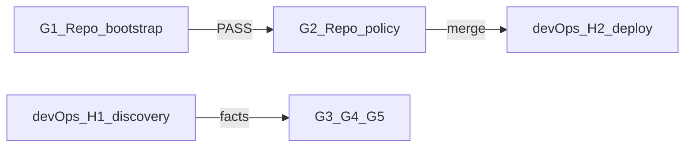

# План выполнения G1 — Repo bootstrap

Источник: [docs/devjunior-routing-split-grok-devops.md](docs/devjunior-routing-split-grok-devops.md) §G1.

**Роль G1 в общем потоке:** первый шаг Grok-track Run 1 (`G1 + G2`). После PASS G1 сразу переходить к G2 (runtime policy foundation). Hermes CLI, deploy и runtime facts — зона devOps (H1/H2), **не входят в G1**.



---

## Ограничения исполнителя (жёстко)

| Разрешено | Запрещено |
|---|---|
| read-only git / find / rg / test | commit, branch, PR |
| локальный Bootstrap Report (вне git) | правки `config.yaml`, `SOUL.md`, skill package |
| фиксация переменных путей | Hermes CLI на runtime host (это H1) |
| эскалация при STOP | коммит или патч `action-execution` |

**Среда:** команды bash — через **Git Bash или WSL**. PowerShell допустим только для `cd` и запуска Git Bash; runtime-скрипты G2+ — только bash.

---

## Подготовка (до G1.1)

### 0.1 Создать Bootstrap Report

Локальный scratch-файл (например `bootstrap-g1-report.txt`), **не коммитить**. Минимальные поля для G1:

```text
G1_DATE=
EXECUTOR=
REPO_ROOT=
PROFILE_ROOT=
PROFILE_ROOT_EQUALS_REPO_ROOT=yes|no
PROFILE_ROOT_COUNT=
ACTION_EXECUTION_DIR=
ACTION_EXECUTION_SKILLS_ROOT=
ACTION_EXECUTION_RELATIVE_DIR=
ACTION_EXECUTION_NAME=action-execution
ACTION_EXECUTION_VERSION=0.5.1
SKILL_PACKAGE_ON_BASE_HEAD=yes|no
SKILL_PACKAGE_COUNT=
G1_RESULT=PASS|STOP
STOP_REASON=
```

### 0.2 Зафиксировать base branch

Определить base workstream (ожидание: `main`):

```bash
cd "$(git rev-parse --show-toplevel)"
git fetch origin 2>/dev/null || true
BASE_BRANCH=main
git checkout "$BASE_BRANCH"
git pull --ff-only origin "$BASE_BRANCH" 2>/dev/null || true
git log -1 --oneline
```

Сохранить `BASE_HEAD_SHA` из последней строки. G1.4 проверяет tracking **именно на этом SHA**.

### 0.3 Текущее ожидаемое состояние repo (на момент планирования)

На `main` @ `bb2adfc`:

- один [`config.yaml`](config.yaml) + один [`SOUL.md`](SOUL.md) в корне repo;
- canonical package: [`skills/autonomous-ai-agents/action-execution/SKILL.md`](skills/autonomous-ai-agents/action-execution/SKILL.md) (`name: action-execution`, `version: 0.5.1`);
- три файла **tracked** на HEAD (`git ls-files` возвращает все три).

Это ожидание — не замена проверок; каждый шаг G1 обязателен на целевой машине.

---

## G1.1 — Определить REPO_ROOT

**Команда:**

```bash
REPO_ROOT="$(git rev-parse --show-toplevel)"
echo "$REPO_ROOT"
```

**Действия:**
1. Записать абсолютный путь в Report → `REPO_ROOT`.
2. Проверить: каталог существует, внутри `.git/`.
3. Зафиксировать `git status --short` (untracked docs/plans не блокируют G1, но отметить в Report).

**PASS:** команда exit 0, путь не пустой.

**STOP:** `git rev-parse` завершился с ошибкой (не git repo).

**Ожидание:** `C:/repos/devjunior_hermes_config` (Windows) или эквивалент.

---

## G1.2 — Найти ровно один PROFILE_ROOT

**Цель:** единственная директория с парой `config.yaml` + `SOUL.md`.

**Команды:**

```bash
cd "$REPO_ROOT"
find . -name config.yaml -not -path './.git/*' 2>/dev/null | while read -r f; do
  d="$(dirname "$f")"
  [ -f "$d/SOUL.md" ] && realpath "$d" 2>/dev/null || readlink -f "$d" 2>/dev/null || echo "$d"
done | sort -u
```

Если `find`/`realpath` недоступны — вручную проверить корень: оба файла в одной директории.

**Подсчёт:**

```bash
PROFILE_CANDIDATES="$( ... команда выше ... | wc -l )"
```

**PASS если:**
- `PROFILE_ROOT_COUNT == 1`;
- `PROFILE_ROOT` нормализован к абсолютному пути;
- `PROFILE_ROOT == REPO_ROOT` → `PROFILE_ROOT_EQUALS_REPO_ROOT=yes`.

**STOP если:**
- `0` кандидатов — нет Hermes profile root в repo;
- `>1` — неоднозначность (нужна ручная эскалация, указать все пути в `STOP_REASON`).

**Сохранить:** `PROFILE_ROOT`.

**Ожидание для этого repo:** `PROFILE_ROOT` = `$REPO_ROOT`.

---

## G1.3 — Найти canonical package action-execution v0.5.1

### G1.3.1 Поиск кандидатов по frontmatter

```bash
cd "$REPO_ROOT"
rg -l '^name:\s*action-execution\s*$' --glob '**/SKILL.md' .
```

Для **каждого** найденного `SKILL.md` проверить version и структуру:

```bash
SKILL_FILE="skills/autonomous-ai-agents/action-execution/SKILL.md"
rg '^name:\s*action-execution\s*$' "$SKILL_FILE"
rg '^version:\s*0\.5\.1\s*$' "$SKILL_FILE"
```

**Исключить ложные срабатывания:**
- [`docs/SKILL_action-execution_devJunior.md`](docs/SKILL_action-execution_devJunior.md) — документация, не package (нет `references/workflow.md` + `references/invariants.md`);
- любые `.cursor/plans/*.plan.md` с `name: action-execution` в YAML frontmatter — не skill packages.

### G1.3.2 Проверка обязательных файлов

Для единственного валидного кандидата:

```bash
AE_DIR="$REPO_ROOT/skills/autonomous-ai-agents/action-execution"
test -f "$AE_DIR/SKILL.md" \
  && test -f "$AE_DIR/references/workflow.md" \
  && test -f "$AE_DIR/references/invariants.md"
echo "structure_check_exit=$?"
```

### G1.3.3 Вычислить и сохранить переменные

| Переменная | Как получить | Ожидаемое значение |
|---|---|---|
| `ACTION_EXECUTION_DIR` | абсолютный путь к корню package | `$REPO_ROOT/skills/autonomous-ai-agents/action-execution` |
| `ACTION_EXECUTION_SKILLS_ROOT` | родительский каталог, который Hermes сканирует через `external_dirs` | `$REPO_ROOT/skills` |
| `ACTION_EXECUTION_RELATIVE_DIR` | путь от `REPO_ROOT` | `skills/autonomous-ai-agents/action-execution` |

Проверка relative path:

```bash
# Linux/Git Bash:
realpath --relative-to="$REPO_ROOT" "$AE_DIR"
```

### G1.3.4 Проверка уникальности (shadowing в repo)

```bash
rg -l '^name:\s*action-execution\s*$' --glob '**/SKILL.md' . | wc -l
# должно быть 1
```

**PASS если:**
- `SKILL_PACKAGE_COUNT == 1`;
- `version == 0.5.1`;
- все три файла на месте.

**STOP если:**
- 0 package;
- >1 package с `name: action-execution`;
- version ≠ 0.5.1;
- отсутствует любой из `SKILL.md`, `references/workflow.md`, `references/invariants.md`.

**Примечание для G2:** `ACTION_EXECUTION_SKILLS_ROOT` будет добавлен в `skills.external_dirs` рядом с существующим `/opt/aidesklab/agent-skills` — оба path сохраняются (см. [`.cursor/plans/devjunior_mandatory_routing_.plan.md`](.cursor/plans/devjunior_mandatory_routing_.plan.md) §«Текущее состояние»).

---

## G1.4 — Проверить skill package tracked на base/HEAD

**Критический gate:** этот workstream **не коммитит** canonical skill. Если файлы untracked на base — **STOP** и отдельный процесс посадки v0.5.1 на base.

**Команды** (на `$BASE_BRANCH` @ `$BASE_HEAD_SHA` из подготовки 0.2):

```bash
cd "$REPO_ROOT"
git checkout "$BASE_BRANCH"
git ls-files -- \
  "skills/autonomous-ai-agents/action-execution/SKILL.md" \
  "skills/autonomous-ai-agents/action-execution/references/workflow.md" \
  "skills/autonomous-ai-agents/action-execution/references/invariants.md"
```

**Дополнительно — нет untracked/modified в package:**

```bash
git status --short -- "skills/autonomous-ai-agents/action-execution/"
# ожидание: пустой вывод
```

**PASS если:**
- `git ls-files` возвращает **ровно 3** path;
- `git status --short` для каталога package пуст;
- `SKILL_PACKAGE_ON_BASE_HEAD=yes`.

**STOP если:**
- любой из трёх файлов отсутствует в index/HEAD;
- файлы есть только как untracked (`??` в status);
- package modified но не закоммичен на base.

**Действие при STOP:** зафиксировать `STOP_REASON=skill_not_on_base_head`, эскалировать оператору — **не начинать G2**, **не создавать Outcome branch**. Разрешённый diff workstream vs base **не включает** эти три файла.

---

## Финальный gate G1

Заполнить чеклист:

| # | Критерий | Поле Report |
|---|---|---|
| 1 | `REPO_ROOT` определён | `REPO_ROOT` |
| 2 | Ровно 1 `PROFILE_ROOT` | `PROFILE_ROOT_COUNT=1` |
| 3 | `PROFILE_ROOT == REPO_ROOT` | `PROFILE_ROOT_EQUALS_REPO_ROOT=yes` |
| 4 | Ровно 1 package v0.5.1 | `SKILL_PACKAGE_COUNT=1` |
| 5 | Три обязательных файла на месте | structure_check exit 0 |
| 6 | Пути сохранены | `ACTION_EXECUTION_*` заполнены |
| 7 | Skill tracked на base HEAD | `SKILL_PACKAGE_ON_BASE_HEAD=yes` |

**Если все 7 — PASS:** `G1_RESULT=PASS`.

**Иначе:** `G1_RESULT=STOP`, указать первый провалившийся пункт в `STOP_REASON`.

---

## Deliverable G1

1. **Bootstrap Report** с заполненными полями (файл вне git).
2. **Краткая сводка для handoff в G2** (можно в конце Report):

```text
REPO_ROOT=<abs>
PROFILE_ROOT=<abs>
ACTION_EXECUTION_DIR=<abs>
ACTION_EXECUTION_SKILLS_ROOT=<abs>
ACTION_EXECUTION_RELATIVE_DIR=skills/autonomous-ai-agents/action-execution
ACTION_EXECUTION_NAME=action-execution
ACTION_EXECUTION_VERSION=0.5.1
BASE_BRANCH=main
BASE_HEAD_SHA=<sha>
G1_RESULT=PASS
```

3. **Никаких git-артефактов** — G1 не создаёт commit/branch/PR.

---

## Handoff: G1 PASS → G2

После PASS немедленно начинать [G2 — Repo runtime policy foundation](docs/devjunior-routing-split-grok-devops.md) в том же Run 1:

- **G2.1** — patch [`config.yaml`](config.yaml): `external_dirs` + runtime policy blocks;
- **G2.2** — append `TASK EXECUTION POLICY` в [`SOUL.md`](SOUL.md);
- **G2.3** — создать `skills.lock` с SHA256 package;
- **G2.4** — создать `scripts/verify-action-execution.sh`.

G2 использует переменные из G1 Report. Полный runtime PASS `hermes -p devjunior ...` — только после deploy devOps (H2).

---

## Что сознательно НЕ входит в G1

Следующее относится к другим фазам и **не выполнять** в рамках G1:

| Шаг | Владелец | Когда |
|---|---|---|
| `hermes --version`, `profile show`, `skills list` | devOps H1 | до G3/G4/G5 |
| Telegram facts, cron inventory | devOps H1 | до G4/G5 |
| Deployment mechanism | devOps H1/H2 | после G2 merge |
| Outcome branch / Task 1 PR | Grok после G1+G2 | Run 1 continuation |
| SHA256 package hash | Grok G2.3 | после G1 PASS |

Полный Bootstrap B4–B5 из [`.cursor/plans/phaze_0_bootstrap_.plan.md`](.cursor/plans/phaze_0_bootstrap_.plan.md) пересекается с devOps H1; для split-модели Grok выполняет **только G1.1–G1.4**.

---

## Оценка времени и рисков

- **Длительность:** 10–20 минут (все команды read-only).
- **Главный риск:** G1.4 STOP — skill untracked на base (сейчас **ожидаемо PASS** на `main` @ `bb2adfc`).
- **Второй риск:** >1 PROFILE_ROOT если repo структурируют иначе (сейчас **ожидаемо PASS** — один корень).
