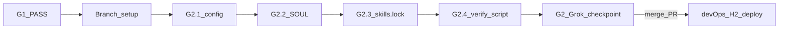
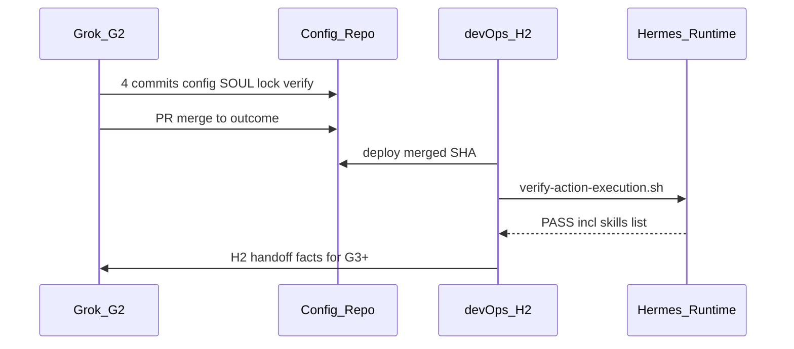

# План выполнения G2 — Repo runtime policy foundation

Источник: [docs/devjunior-routing-split-grok-devops.md](docs/devjunior-routing-split-grok-devops.md) §G2.

**Роль G2 в общем потоке:** второй шаг Grok-track Run 1 (`G1 + G2`). Соответствует исходным **Task 1 + Task 2** из [`.cursor/plans/devjunior_mandatory_routing_.plan.md`](.cursor/plans/devjunior_mandatory_routing_.plan.md). После merge G2 → devOps выполняет **H2** (deploy + runtime PASS).



---

## Жёсткий gate: только после G1 PASS

**Не начинать G2**, если Bootstrap Report из G1 содержит `G1_RESULT=STOP`.

Обязательные входные переменные из G1 Report:

| Переменная | Использование в G2 |
|---|---|
| `REPO_ROOT` | корень git, base для relative paths |
| `PROFILE_ROOT` | target для всех 4 файлов (ожидание: `== REPO_ROOT`) |
| `ACTION_EXECUTION_DIR` | hash + verify checks 2–5 |
| `ACTION_EXECUTION_SKILLS_ROOT` | `skills.external_dirs` в G2.1, verify check 8 |
| `ACTION_EXECUTION_RELATIVE_DIR` | `skills.lock` (ожидание: `skills/autonomous-ai-agents/action-execution`) |
| `ACTION_EXECUTION_NAME` | `action-execution` |
| `ACTION_EXECUTION_VERSION` | `0.5.1` |
| `BASE_BRANCH` / `BASE_HEAD_SHA` | base для outcome branch |

---

## Ограничения исполнителя (Grok/Cursor)

| Разрешено | Запрещено |
|---|---|
| правки [`config.yaml`](config.yaml), [`SOUL.md`](SOUL.md) | Hermes runtime на production host |
| создание `skills.lock`, `scripts/verify-action-execution.sh` | deploy profile (H2) |
| 4 отдельных commit, branch, PR | правки skill package (`SKILL.md`, `workflow.md`, `invariants.md`) |
| `bash -n`, static/yaml проверки | Telegram topic binding (G4) |
| локальный G2 Report (вне git) | `devjunior-task.sh`, cron scripts (G3/G5) |
| | commit token/chat_id, model/provider override |
| | прямое редактирование `jobs.json` |

**Среда:** bash-скрипты писать и проверять через **Git Bash или WSL** (`bash -n`, `chmod +x`).

---

## Подготовка (до G2.1)

### 0.1 Проверить G1 handoff

Перечитать Bootstrap Report; убедиться, что `SKILL_PACKAGE_ON_BASE_HEAD=yes`.

### 0.2 Создать G2 Work Report (локально, не коммитить)

```text
G2_DATE=
EXECUTOR=
G1_RESULT=PASS
REPO_ROOT=
PROFILE_ROOT=
ACTION_EXECUTION_SKILLS_ROOT=
ACTION_EXECUTION_RELATIVE_DIR=
ACTION_EXECUTION_PACKAGE_SHA256=
OUTCOME_BRANCH=outcome/devjunior-mandatory-action-execution
G2_BRANCH=task/devjunior-runtime-foundation
G2_RESULT=PASS|STOP
STOP_REASON=
```

### 0.3 Создать ветки

От `$BASE_BRANCH` @ `$BASE_HEAD_SHA`:

```bash
cd "$REPO_ROOT"
git checkout "$BASE_BRANCH"
git pull --ff-only origin "$BASE_BRANCH" 2>/dev/null || true
git checkout -b outcome/devjunior-mandatory-action-execution
git checkout -b task/devjunior-runtime-foundation
```

**Правило:** один Action = один файл = один commit. Не squash G2.1–G2.4.

### 0.4 Зафиксировать текущий diff-baseline

Текущее состояние [`config.yaml`](config.yaml) vs target (сохранить всё unrelated):

| Поле | Сейчас | Target G2.1 |
|---|---|---|
| `skills.external_dirs` | только `/opt/aidesklab/agent-skills` | **сохранить** + добавить `$ACTION_EXECUTION_SKILLS_ROOT` один раз |
| `skills.project_discovery` | отсутствует | `false` |
| `agent.tool_use_enforcement` | `auto` | `true` |
| `agent.execution_guidance` | отсутствует | `true` (сохранить `task_completion_guidance`, `verify_guidance`, `parallel_tool_call_guidance` и др.) |
| `tool_loop_guardrails.warn_after.same_tool_failure` | `2` | `3` |
| `tool_loop_guardrails.hard_stop_after.exact_failure` | `4` | `5` |
| `tool_loop_guardrails.hard_stop_after.same_tool_failure` | `5` | `8` |
| `tool_loop_guardrails.hard_stop_after.idempotent_no_progress` | `4` | `5` |
| `tool_loop_guardrails.loop_caps` | есть | **не трогать** |
| `cron.*` | секции нет | добавить блок |
| `approvals.mode` / `cron_mode` | `smart` / `deny` | **не менять** |
| `telegram.*` | есть top-level | **не менять** (G4) |
| `model.*`, `mcp_servers`, `terminal.cwd` | есть | **не менять** |

[`SOUL.md`](SOUL.md): блока `TASK EXECUTION POLICY` **нет** — append в G2.2.

`skills.lock`, [`scripts/verify-action-execution.sh`](scripts/verify-action-execution.sh): **не существуют**.

---

## G2.1 — Patch `config.yaml`

**Target:** [`<PROFILE_ROOT>/config.yaml`](config.yaml) — единственный изменённый файл.

### Шаги

1. Открыть `config.yaml`; **не переписывать** файл целиком — точечный patch секций `skills`, `agent`, `tool_loop_guardrails`, добавить `cron`.
2. Секция `skills` — итоговый вид:

```yaml
skills:
  external_dirs:
    - /opt/aidesklab/agent-skills          # existing — сохранить
    - <ACTION_EXECUTION_SKILLS_ROOT>       # абс. путь из G1, один раз
  project_discovery: false
  template_vars: true                       # existing — сохранить
  inline_shell: false
  inline_shell_timeout: 10
  guard_agent_created: false
  write_approval: false
```

3. Секция `agent` — изменить/добавить только:

```yaml
  tool_use_enforcement: true
  execution_guidance: true
```

4. Секция `tool_loop_guardrails` — обновить пороги; **`loop_caps` оставить без изменений**:

```yaml
tool_loop_guardrails:
  warnings_enabled: true
  hard_stop_enabled: true
  warn_after:
    exact_failure: 2
    same_tool_failure: 3
    idempotent_no_progress: 2
  hard_stop_after:
    exact_failure: 5
    same_tool_failure: 8
    idempotent_no_progress: 5
  loop_caps:                              # unchanged
    max_web_searches: 50
    max_subagents: 10
```

5. Добавить секцию `cron` (если `cron.model` / `cron.model_provider` появятся позже — сохранить; сейчас их нет):

```yaml
cron:
  preflight: true
  model_drift_guard: true
  allow_agent_scheduling: false
```

6. `approvals` — уже корректны; не трогать.

### Verification G2.1 (repo-only)

```bash
# YAML parse (Python или yq, если доступны)
python -c "import yaml; yaml.safe_load(open('config.yaml'))"

# Spot-check ключей
rg 'project_discovery:\s*false' config.yaml
rg 'tool_use_enforcement:\s*true' config.yaml
rg 'execution_guidance:\s*true' config.yaml
rg 'allow_agent_scheduling:\s*false' config.yaml
# external_dirs: оба path present
rg 'external_dirs:' -A5 config.yaml
```

**PASS:** YAML парсится; все target-значения на месте; unrelated blocks не удалены.

**STOP:** parse error; `/opt/aidesklab/agent-skills` удалён; `loop_caps` изменён; Telegram/model/provider затронуты.

### Commit G2.1

```text
config(devjunior): enforce task runtime policy
```

---

## G2.2 — Append `TASK EXECUTION POLICY` в `SOUL.md`

**Target:** [`<PROFILE_ROOT>/SOUL.md`](SOUL.md) — единственный изменённый файл.

### Шаги

1. **Append exactly once** в конец файла (после секции `## Style`).
2. **Не редактировать** существующий блок `## Task intake (mandatory)` и остальной текст.
3. **Не копировать** workflow из skill — только policy routing.
4. Вставить **verbatim** (из [docs/devjunior-config-mandatory-skill-implementation-plan.md](docs/devjunior-config-mandatory-skill-implementation-plan.md) Action 1.2):

```md
# TASK EXECUTION POLICY

For every Kaneo entity with label `Task` assigned to `devJunior`,
execution is permitted only when the current session has the
`action-execution` skill preloaded before the task instruction.

Never execute a Kaneo Task through generic coding behavior.
Never implement a Task directly from Task text.
Never substitute another coding skill for `action-execution`.
Never bypass Action Gate, Task Gate, FAIL semantics, execution evidence,
or transition_guard.

If a Task execution request reaches a session where `action-execution`
was not preloaded, do not execute the Task and do not call Cursor.
Stop with the exact reason `SKILL_NOT_LOADED`.

Cron, Telegram, CLI, and future dispatchers are subject to the same rule.

The detailed Task execution procedure belongs only to `action-execution`.
Do not duplicate or reconstruct that procedure from memory.
```

### Verification G2.2

```bash
rg -c 'TASK EXECUTION POLICY' SOUL.md    # ожидание: 1
rg -c 'SKILL_NOT_LOADED' SOUL.md        # ожидание: 1
rg 'references/workflow' SOUL.md        # ожидание: 0 (workflow не скопирован)
```

**PASS:** оба маркера ровно 1 раз; старый «Task intake» не изменён.

**STOP:** дубликат маркеров; workflow skill скопирован в SOUL.

### Commit G2.2

```text
policy(devjunior): require action-execution for tasks
```

---

## G2.3 — Создать `skills.lock`

**Target:** [`<PROFILE_ROOT>/skills.lock`](skills.lock) — новый файл, единственное изменение в commit.

### Шаги

1. Вычислить `ACTION_EXECUTION_PACKAGE_SHA256` по алгоритму:

```text
Для каждого regular file внутри ACTION_EXECUTION_DIR:
  1. relative path от корня package
  2. SHA256 содержимого файла
  3. sort paths bytewise
  4. aggregate: "<sha256>  <relative-path>\n"  (два пробела)
  5. SHA256 от aggregate string
```

Исключить: `.git`, `__pycache__`, editor/temp files.

**Reference implementation (Git Bash):**

```bash
AE_DIR="$ACTION_EXECUTION_DIR"
(
  cd "$AE_DIR"
  find . -type f \
    ! -path './.git/*' \
    ! -path '*/__pycache__/*' \
    ! -name '.*~' ! -name '*.swp' \
    -print0 \
  | sort -z \
  | while IFS= read -r -d '' f; do
      rel="${f#./}"
      h="$(sha256sum "$f" | awk '{print $1}')"
      printf '%s  %s\n' "$h" "$rel"
    done \
  | sha256sum | awk '{print $1}'
)
```

2. Создать `skills.lock` — **ровно 4 строки**, формат `KEY=value`:

```text
ACTION_EXECUTION_NAME=action-execution
ACTION_EXECUTION_VERSION=0.5.1
ACTION_EXECUTION_RELATIVE_DIR=skills/autonomous-ai-agents/action-execution
ACTION_EXECUTION_PACKAGE_SHA256=<computed>
```

3. Повторный расчёт hash → тот же результат.

4. Записать hash в G2 Work Report.

### Verification G2.3

```bash
test -f skills.lock
grep -c '^ACTION_EXECUTION_' skills.lock   # ожидание: 4
# Повтор hash == значение в lock
```

**PASS:** 4 ключа; hash стабилен; package содержит ровно 3 tracked файла (на текущий момент).

**STOP:** hash mismatch при повторе; relative dir не совпадает с G1.

### Commit G2.3

```text
chore(devjunior): pin action-execution package
```

---

## G2.4 — Создать `scripts/verify-action-execution.sh`

**Target:** [`<PROFILE_ROOT>/scripts/verify-action-execution.sh`](scripts/verify-action-execution.sh) — новый файл; `mkdir -p scripts/` допустим в рамках этого Action.

### Skeleton

```bash
#!/usr/bin/env bash
set -euo pipefail

SCRIPT_DIR="$(cd "$(dirname "${BASH_SOURCE[0]}")" && pwd)"
PROFILE_ROOT="$(cd "$SCRIPT_DIR/.." && pwd)"
REPO_ROOT="$PROFILE_ROOT"   # valid when PROFILE_ROOT == REPO_ROOT

fail() { echo "ACTION_EXECUTION_PREFLIGHT=FAIL"; echo "reason=$1"; exit 1; }
pass() { echo "ACTION_EXECUTION_PREFLIGHT=PASS"; echo "name=$1"; echo "version=$2"; echo "sha256=$3"; exit 0; }
```

**Hard-coded clone path запрещён** — только derive от `$SCRIPT_DIR`.

### 10 обязательных проверок

| # | Check | Fail reason (пример) |
|---|---|---|
| 1 | `skills.lock` exists; 4 keys present | `lock_missing`, `lock_incomplete` |
| 2 | `$PROFILE_ROOT/$ACTION_EXECUTION_RELATIVE_DIR` resolves inside `REPO_ROOT` | `package_outside_repo` |
| 3 | `SKILL.md`, `references/workflow.md`, `references/invariants.md` exist | `skill_files_missing` |
| 4 | frontmatter `name`/`version` match lock exactly | `name_mismatch`, `version_mismatch` |
| 5 | recomputed package hash == lock | `hash_mismatch` |
| 6 | `hermes -p devjunior skills list` contains `action-execution` | `skill_not_visible` |
| 7 | `skills.project_discovery` in config is `false` | `project_discovery_enabled` |
| 8 | canonical skills root in `skills.external_dirs` (if package not profile-local) | `external_dir_missing` |
| 9 | no higher-precedence duplicate `action-execution` in profile-local `skills/` | `duplicate_skill_shadowing` |
| 10 | script never auto-fixes anything | design constraint |

**Check 9 logic:** scan `$PROFILE_ROOT/skills/**/SKILL.md` for `name: action-execution`; if any found while canonical is external → FAIL.

**Check 6 note:** реализовать обязательно; при Grok checkpoint (см. ниже) допускается `skill_not_visible` если Hermes не установлен локально — **полный PASS check 6 = devOps H2.2**.

**Success stdout (exact format):**

```text
ACTION_EXECUTION_PREFLIGHT=PASS
name=action-execution
version=0.5.1
sha256=<actual>
```

**Failure stdout:**

```text
ACTION_EXECUTION_PREFLIGHT=FAIL
reason=<short-machine-readable-reason>
```

non-zero exit.

### Verification G2.4

```bash
bash -n scripts/verify-action-execution.sh
chmod +x scripts/verify-action-execution.sh

# Static checks 1-5, 7-9 (если Hermes недоступен — check 6 ожидаемо FAIL)
./scripts/verify-action-execution.sh || true
```

**PASS Grok gate:** `bash -n` exit 0; checks 1–5, 7–9 проходят при локальном запуске.

**PASS full (H2.2):** весь script exit 0 включая check 6 на deployed profile.

### Commit G2.4

```text
feat(devjunior): verify action-execution integrity
```

---

## G2 Grok checkpoint (перед PR)

### Обязательные repo/static проверки

```bash
cd "$REPO_ROOT"

# 4 commits на task branch
git log --oneline outcome/devjunior-mandatory-action-execution..HEAD

# Diff scope: только ожидаемые файлы
git diff --name-only outcome/devjunior-mandatory-action-execution..HEAD
# ожидание:
#   config.yaml
#   SOUL.md
#   skills.lock
#   scripts/verify-action-execution.sh

# Skill package НЕ в diff
git diff --name-only outcome/devjunior-mandatory-action-execution..HEAD \
  | rg 'skills/autonomous-ai-agents/action-execution' && STOP

# Syntax
bash -n scripts/verify-action-execution.sh

# SOUL markers
rg -c 'TASK EXECUTION POLICY|SKILL_NOT_LOADED' SOUL.md

# Config spot-check (см. G2.1)
```

### Чеклист G2 (все пункты = PASS)

| # | Критерий |
|---|---|
| 1 | `skills.project_discovery=false` |
| 2 | `ACTION_EXECUTION_SKILLS_ROOT` ∈ `skills.external_dirs` |
| 3 | existing `/opt/aidesklab/agent-skills` сохранён |
| 4 | `agent.tool_use_enforcement=true`, `execution_guidance=true` |
| 5 | `tool_loop_guardrails` пороги обновлены, `loop_caps` сохранён |
| 6 | `cron.preflight/model_drift_guard/allow_agent_scheduling` добавлены |
| 7 | SOUL содержит `TASK EXECUTION POLICY` + `SKILL_NOT_LOADED` (×1) |
| 8 | `skills.lock` — 4 ключа, hash верифицирован |
| 9 | `verify-action-execution.sh` — `bash -n` PASS, checks 1–5/7–9 PASS |
| 10 | Diff не включает skill package files |

**Явно НЕ входит в Grok checkpoint:** полный `hermes -p devjunior config show`, runtime deploy, Telegram — это **H2**.

---

## PR и merge

```bash
git push -u origin task/devjunior-runtime-foundation
gh pr create --base outcome/devjunior-mandatory-action-execution \
  --title "G2: devJunior runtime policy foundation" \
  --body "## Summary
- config.yaml: external_dirs + project_discovery + agent/guardrails/cron policy
- SOUL.md: TASK EXECUTION POLICY
- skills.lock: pin action-execution v0.5.1
- verify-action-execution.sh: integrity preflight

## Test plan
- [ ] bash -n verify script
- [ ] static verify checks 1-5, 7-9 PASS
- [ ] SOUL markers exactly once
- [ ] Full runtime PASS deferred to devOps H2"
```

Merge PR → `outcome/devjunior-mandatory-action-execution`. Дальнейший merge outcome → `main` — по операторскому процессу (не часть G2).

---

## Handoff G2 → H2 (devOps)

После merge передать devOps:

```text
MERGED_BRANCH=outcome/devjunior-mandatory-action-execution
MERGED_SHA=<sha>
PROFILE_ROOT=<abs>
ACTION_EXECUTION_SKILLS_ROOT=<abs>
skills.lock SHA256=<hash>

H2 actions:
1. Deploy merged revision штатным mechanism
2. <deployed-profile>/scripts/verify-action-execution.sh  → MUST PASS (incl. hermes check)
3. hermes -p devjunior config show  → project_discovery=false, guards configured
4. hermes -p devjunior skills list  → action-execution visible, version/hash match
5. Handoff facts → G3/G4/G5 (Hermes CLI syntax, Telegram, cron flags)
```



---

## Оценка времени и риски

| Риск | Митигация |
|---|---|
| Неверный absolute path в `external_dirs` на deploy host | H2.2 verify check 6/8; path = `$REPO_ROOT/skills` при PROFILE_ROOT==REPO_ROOT |
| Hash drift при лишних файлах в package | Package сейчас ровно 3 файла; не добавлять файлы в package в G2 |
| Check 6 FAIL локально без Hermes | Ожидаемо; Grok gate = static; full PASS = H2 |
| Случайное изменение unrelated config | Diff review по таблице G2.1; один файл per commit |
| G1.4 был STOP | G2 не стартовать |

**Длительность:** 45–90 минут (4 commits + verify script + PR).

---

## Что сознательно НЕ входит в G2

| Шаг | Владелец | Когда |
|---|---|---|
| `devjunior-task.sh` | G3 | после H1/H2 facts |
| Telegram topic binding | G4 | после `TELEGRAM_CONFIGURED` |
| cron ensure/audit scripts | G5 | после cron CLI flags |
| `audit-devjunior-runtime.sh` | G6 | после G3–G5 |
| pilot runbook | G7 | финальная итерация |
| Hermes CLI discovery | H1 | параллельно / до G3 |
| Deploy + runtime PASS | H2 | после G2 merge |
