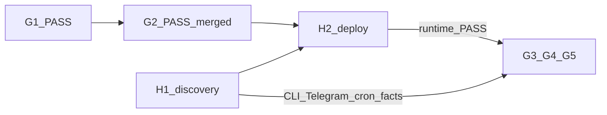
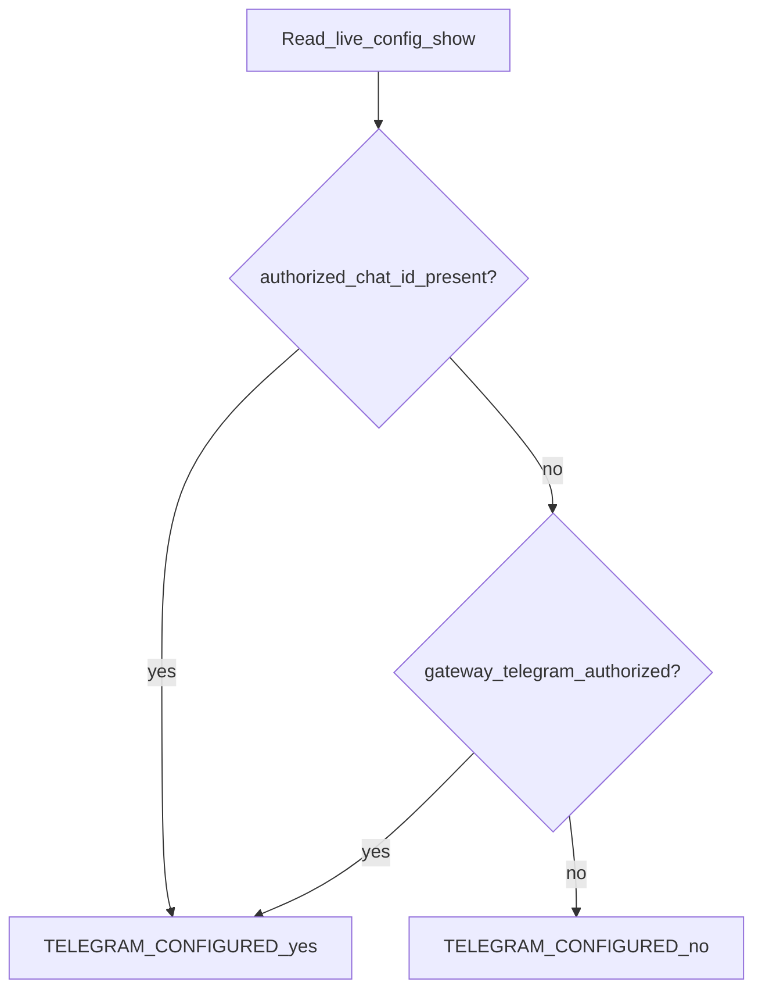
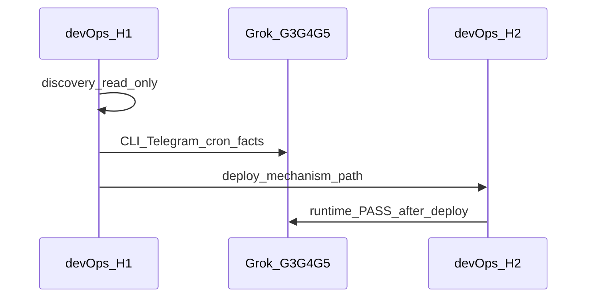

# План выполнения H1 — Runtime discovery

Источник: [docs/devjunior-routing-split-grok-devops.md](docs/devjunior-routing-split-grok-devops.md) §H1 (TRACK B). Пересечение с Фазой 0 B4–B5 из [`.cursor/plans/phaze_0_bootstrap_.plan.md`](.cursor/plans/phaze_0_bootstrap_.plan.md); в split-модели это **только** зона **devOps**.

**Роль H1:** первый шаг devOps-track Run 1 (`H1 + H2`). Собрать live facts до реализации G3/G4/G5. G1/G2 уже PASS (`MERGED_SHA=3ead4aed…` в [g2-work-report.txt](g2-work-report.txt)); H1 можно выполнять **параллельно** с Grok-track или сразу после G2 — **до** старта G3/G4/G5.



---

## Ограничения исполнителя (devOps)

| Разрешено | Запрещено |
|---|---|
| `hermes …` read-only на runtime host | правки repo (`config.yaml`, `SOUL.md`, scripts) |
| чтение live config / profile path / `jobs.json` | edit/create cron jobs |
| сохранение help/output в локальный Report | restart gateway / deploy (это H2) |
| фиксация deployment command (документация) | commit / PR / fake chat_id / token |
| `diff`/`readlink`/`ls` deployed vs repo | запись в `jobs.json`, pairing approve |

**Среда:** bash на **хосте, где реально работает профиль `devjunior`** (gateway/cron). Не Windows-dev с `CHECK6_LOCAL=hermes_not_found`.

---

## Подготовка (до H1.1)

### 0.1 Выбрать runtime host

Подтвердить доступ SSH/shell к машине с установленным `hermes` и профилем `devjunior`. Если CLI отсутствует → `H1_RESULT=STOP`, `STOP_REASON=hermes_cli_missing`.

### 0.2 Создать H1 Discovery Report

Локальный scratch (например `h1-discovery-report.txt`), **не коммитить**:

```text
H1_DATE=
EXECUTOR=
HOST=
HOST_OS=
HERMES_VERSION=
PROFILE_RUNTIME_PATH=
CURRENT_MODEL=
CURRENT_PROVIDER=
ACTION_EXECUTION_VISIBLE=yes|no
CRON_SCHEDULER_STATUS=
TELEGRAM_CONFIGURED=yes|no
AUTHORIZED_CHAT_ID=
DM_TOPICS_SCHEMA=dm_topics|group_topics|none|unknown
IGNORE_ROOT_DM_SUPPORT=yes|no|unknown
SKILL_BINDING_SUPPORT=yes|no|unknown
EXISTING_TOPICS=
DEPLOYMENT_MECHANISM=
DEPLOYMENT_COMMAND=
DEPLOYED_REVISION=
WORKDIR_FLAG=
SKILL_PRELOAD_FLAG=
CRON_CREATE_FLAGS=
CRON_EDIT_FLAGS=
CRON_LIST_FORMAT=
MODEL_FLAG=
PROVIDER_FLAG=
EXISTING_DEVJUNIOR_CRON_JOBS=
H1_RESULT=PASS|STOP
STOP_REASON=
```

Сохранять сырые артефакты help/list в `/tmp/h1-*.txt` (или рядом с Report) — они входят в handoff Grok.

### 0.3 Контекст из G1/G2 (справочно, не подмена live)

Из [bootstrap-g1-report.txt](bootstrap-g1-report.txt) / [g2-work-report.txt](g2-work-report.txt):

- `REPO_ROOT` / `PROFILE_ROOT` = config repo
- `ACTION_EXECUTION_RELATIVE_DIR=skills/autonomous-ai-agents/action-execution`
- `ACTION_EXECUTION_PACKAGE_SHA256=13f742a7…`
- `MERGED_SHA=3ead4aed…` (для будущего H2, не для H1)

H1 фиксирует **runtime path и live values**, не repo paths.

---

## H1.1 — Hermes identity

### Шаги

```bash
which hermes
hermes --version 2>&1 | tee /tmp/h1-hermes-version.txt

hermes profile list 2>&1 | tee /tmp/h1-profile-list.txt
hermes profile show devjunior 2>&1 | tee /tmp/h1-profile-show.txt

hermes -p devjunior config show 2>&1 | tee /tmp/h1-config-show.txt
hermes -p devjunior skills list 2>&1 | tee /tmp/h1-skills-list.txt
hermes -p devjunior cron status 2>&1 | tee /tmp/h1-cron-status.txt
```

### Извлечь и записать в Report

1. `HERMES_VERSION` — полная строка версии.
2. `PROFILE_RUNTIME_PATH` — путь профиля из `profile show` (ожидание: `~/.hermes/profiles/devjunior` или `$HERMES_HOME/profiles/devjunior`; см. [docs/hermes_skills_enforcement_guide.md](docs/hermes_skills_enforcement_guide.md) §1).
3. `CURRENT_MODEL` / `CURRENT_PROVIDER` — **только** из live `config show`, не из плана и не из repo-догадок.
4. `ACTION_EXECUTION_VISIBLE` — есть ли `action-execution` в `skills list` (**NO до H2 допустим** — не STOP для H1).
5. `CRON_SCHEDULER_STATUS` — running/stopped; **не менять**.

### PASS / STOP

- **PASS:** все команды exit 0 (кроме допустимых warnings); профиль `devjunior` существует; model/provider записаны.
- **STOP:** `Profile 'devjunior' does not exist` → сначала вне workstream развернуть профиль штатным deploy; повторить H1.
- **STOP:** `hermes` not found / permission denied на runtime host.

---

## H1.2 — CLI contracts

Цель: exact supported flags для G3 (`devjunior-task.sh`) и G5 (`ensure-devjunior-cron.sh`). **Не угадывать** `--in` / `--workdir`.

### Шаги

```bash
hermes --help 2>&1 | tee /tmp/h1-hermes-help.txt
hermes chat --help 2>&1 | tee /tmp/h1-chat-help.txt
hermes cron --help 2>&1 | tee /tmp/h1-cron-help.txt
hermes cron create --help 2>&1 | tee /tmp/h1-cron-create-help.txt
hermes cron edit --help 2>&1 | tee /tmp/h1-cron-edit-help.txt
hermes cron list --help 2>&1 | tee /tmp/h1-cron-list-help.txt
```

### Нормализовать в Report (таблица флагов)

| Report field | Где искать | Семантика для Grok |
|---|---|---|
| `WORKDIR_FLAG` | global / `chat` / `cron` help | product absolute path (`--in` / `--workdir` / cwd-only / other) |
| `SKILL_PRELOAD_FLAG` | `chat --help` | preload (`-s` / `--skills`) |
| `CRON_CREATE_FLAGS` | `cron create --help` | полный список релевантных: skill, workdir, schedule, name, prompt… |
| `CRON_EDIT_FLAGS` | `cron edit --help` | аналогично |
| `CRON_LIST_FORMAT` | `cron list --help` + sample list output | как читать name/skills/workdir |
| `MODEL_FLAG` | create/edit help | present\|absent + exact name |
| `PROVIDER_FLAG` | create/edit help | present\|absent + exact name |

Дополнительно подтвердить global `-p` / `--profile`.

### Известный риск

На части версий (напр. v0.19.0) `--provider`/`--model` могут отсутствовать в `cron create`, а `--in` — в global help. H1 **обязан** зафиксировать факт; G3/G5 адаптируют syntax под help, сохраняя семантику (profile + workdir + skill preload + pin model/provider где возможно).

### PASS / STOP

- **PASS:** все `--help` сохранены; таблица флагов заполнена без догадок (`absent` допустим).
- **STOP:** help недоступен / команды падают — нельзя отдавать Grok для G3/G5.

---

## H1.3 — Telegram runtime facts

**Ничего не менять.** Источник истины — live `config show` + gateway, не repo [`config.yaml`](config.yaml) (там сейчас только top-level `telegram.require_mention` без chat_id).

### Алгоритм `TELEGRAM_CONFIGURED`



### Шаги

```bash
# уже есть /tmp/h1-config-show.txt
rg -i 'telegram|chat_id|dm_topics|group_topics|ignore_root_dm|thread_id|skill' /tmp/h1-config-show.txt

hermes -p devjunior gateway status 2>&1 | tee /tmp/h1-gateway-status.txt || true
hermes -p devjunior pairing list 2>&1 | tee /tmp/h1-pairing-list.txt || true
```

При необходимости read-only файл deployed config:

```bash
RUNTIME="${PROFILE_RUNTIME_PATH}"
rg -n 'telegram|platforms|dm_topics|ignore_root_dm' "$RUNTIME/config.yaml" || true
```

### Записать

- `TELEGRAM_CONFIGURED=yes|no`
- при `yes`: exact `AUTHORIZED_CHAT_ID` (без выдумывания)
- `DM_TOPICS_SCHEMA` = `dm_topics` | `group_topics` | `none` | `unknown`
- `IGNORE_ROOT_DM_SUPPORT` — поддержка/наличие `ignore_root_dm` в schema/config
- `SKILL_BINDING_SUPPORT` — можно ли биндить `topic.skill` (наличие поля/доков в live schema)
- `EXISTING_TOPICS` — имена, `thread_id` (если есть), skill; отдельно отметить, есть ли `devJunior Tasks`

### Связь с G4

- `TELEGRAM_CONFIGURED=no` → G4 = `NOT_APPLICABLE` (no commit).
- `yes` → Grok использует **только** эти facts для `ignore_root_dm=true`, topic `devJunior Tasks`, `skill=action-execution`; **не** invent `thread_id`/token/chat_id.

### PASS / STOP

- **PASS:** решение yes/no задокументировано с evidence.
- **STOP:** нельзя определить yes/no (нет доступа к live config/gateway) — эскалация оператору.

---

## H1.4 — Deployment mechanism

Цель: exact путь `config repo → deployed devjunior profile` для H2.1 / H5.

### Шаги расследования (read-only)

```bash
RUNTIME="${PROFILE_RUNTIME_PATH}"
ls -la "$RUNTIME"
readlink -f "$RUNTIME" 2>/dev/null || true

# сравнить с clone config-repo на host, если есть
# REPO_CLONE=<path to git clone of DmitryDe/devjunior_hermes_config>
# diff -qr "$REPO_CLONE" "$RUNTIME" 2>/dev/null | head -40

hermes profile info devjunior 2>&1 | tee /tmp/h1-profile-info.txt || true
test -f "$RUNTIME/distribution.yaml" && cat "$RUNTIME/distribution.yaml" || true
```

Проверить runbook/CI/systemd/ansible/cron sync на host — **не изобретать** новый механизм.

### Записать одной строкой

Примеры допустимых значений:

- `manual rsync REPO → ~/.hermes/profiles/devjunior`
- `hermes profile install <git-url>`
- `symlink REPO_ROOT → HERMES_HOME/profiles/devjunior`
- `ansible playbook X`

Плюс:

- `DEPLOYMENT_COMMAND` — exact команда/service unit для H2
- `DEPLOYED_REVISION` — git SHA / tag / mtime evidence текущего deployed дерева, если доступно

### PASS / STOP

- **PASS H1:** механизм известен **или** явно `DEPLOYMENT_MECHANISM=UNKNOWN` с пометкой «блокер для H2».
- **Жёсткий блокер H2:** `UNKNOWN` → H2.1 не начинать, пока оператор не подтвердит команду.

---

## H1.5 — Existing cron inventory

Read-only:

```bash
hermes -p devjunior cron list 2>&1 | tee /tmp/h1-cron-list.txt

JOBS_FILE="${PROFILE_RUNTIME_PATH}/cron/jobs.json"
# fallback: ${HERMES_HOME:-$HOME/.hermes}/profiles/devjunior/cron/jobs.json
[ -f "$JOBS_FILE" ] && rg -n 'devjunior:' "$JOBS_FILE" | tee /tmp/h1-cron-jobs-rg.txt || true
```

Для каждого `devjunior:*` (и кратко — других jobs, если мешают inventory):

```text
job_id=
name=
schedule=
skills=
workdir=
model=
provider=
prompt_summary=
```

**Не редактировать** `jobs.json`. Пустой список `devjunior:*` — нормален.

### PASS / STOP

- **PASS:** inventory зафиксирован (возможно empty).
- **STOP:** нельзя прочитать list и нет доступа к `jobs.json` при необходимости деталей для G5.

---

## H1 checkpoint — Go/No-Go

Все пункты **AND** для `H1_RESULT=PASS`:

1. `HERMES_VERSION` заполнен
2. `PROFILE_RUNTIME_PATH` существует, `profile show` OK
3. `CURRENT_MODEL` + `CURRENT_PROVIDER` из live config
4. CLI help-файлы сохранены; флаги нормализованы (absent допустим)
5. `TELEGRAM_CONFIGURED` = yes|no с evidence
6. `DEPLOYMENT_MECHANISM` записан (или `UNKNOWN` + explicit H2 blocker note)
7. Cron inventory `devjunior:*` перечислен
8. Report + `/tmp/h1-*.txt` готовы к передаче Grok / следующему H2

**После PASS:** можно переходить к **H2** (после G2 merge — уже есть) и отдавать facts для **G3/G4/G5**.

**После STOP:** устранить причину вне H1 (установить Hermes, создать profile, дать доступ к gateway) → повторить H1 с нуля.

---

## Handoff H1 → Grok (G3/G4/G5) и H2

Минимальный пакет для Grok:

```text
HERMES_VERSION=
WORKDIR_FLAG=
SKILL_PRELOAD_FLAG=
CRON_CREATE_FLAGS=
CRON_EDIT_FLAGS=
CRON_LIST_FORMAT=
MODEL_FLAG=
PROVIDER_FLAG=
TELEGRAM_CONFIGURED=
AUTHORIZED_CHAT_ID=          # if yes
DM_TOPICS_SCHEMA=
IGNORE_ROOT_DM_SUPPORT=
SKILL_BINDING_SUPPORT=
EXISTING_TOPICS=
DEPLOYMENT_MECHANISM=
EXISTING_DEVJUNIOR_CRON_JOBS=
CURRENT_MODEL=
CURRENT_PROVIDER=
```

Плюс вложения: `/tmp/h1-*-help.txt`, `h1-config-show.txt`, `h1-cron-list.txt`.

H2 дополнительно использует: `DEPLOYMENT_COMMAND`, `PROFILE_RUNTIME_PATH`, `MERGED_SHA` из G2.



---

## Типичные STOP / риски

| ID | Ситуация | Действие |
|---|---|---|
| S1 | Нет `hermes` на host | Установить CLI / выбрать правильный host |
| S2 | Нет профиля `devjunior` | Deploy profile вне H1; повторить |
| S3 | Help/flags не сняты | Повторить H1.2 на той же версии |
| S4 | Telegram yes/no неясен | Доступ к live config/gateway; не угадывать |
| S5 | Deploy mechanism UNKNOWN | Уточнить у оператора до H2 |
| R1 | `action-execution` не в skills list | Ожидаемо до H2; не STOP H1 |
| R2 | Cron create без `--model`/`--provider` | Зафиксировать `absent`; G5 учтёт |

---

## Что H1 явно НЕ делает

- Не deploy G2 SHA (H2)
- Не запускает `verify-action-execution.sh` как gate (H2.2)
- Не пишет repo scripts / Telegram config (G3/G4)
- Не provision cron (H4)
- Не pilot (H6)
