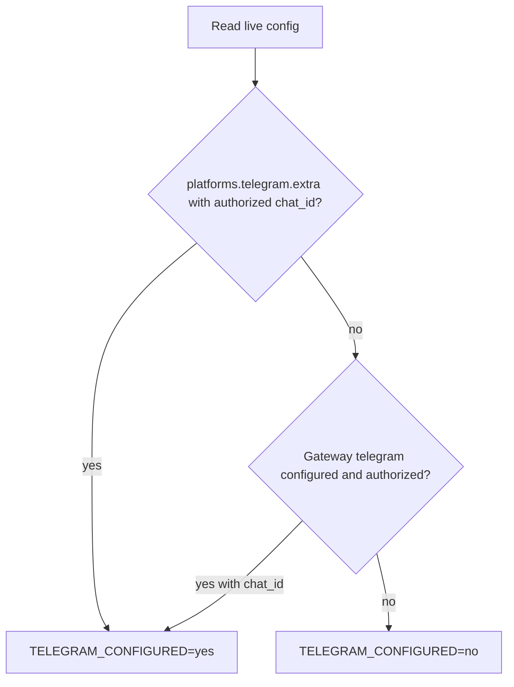
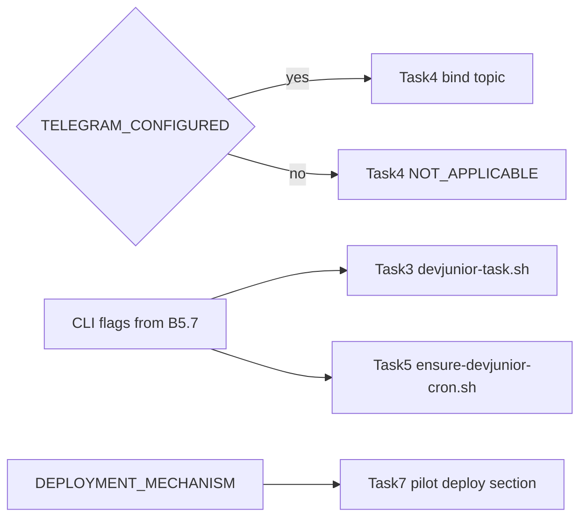

# Фаза 0 — Bootstrap (детальный план исполнения)

Источник: [`.cursor/plans/devjunior_mandatory_routing_30040c9c.plan.md`](.cursor/plans/devjunior_mandatory_routing_30040c9c.plan.md) §«Фаза 0», [docs/devjunior-config-mandatory-skill-implementation-plan.md](docs/devjunior-config-mandatory-skill-implementation-plan.md) §Bootstrap.

**Цель фазы:** собрать все runtime-зависимые факты, без которых Tasks 1–7 нельзя выполнять корректно. **Никаких commit, branch, правок файлов.**

**Среда выполнения:** bash-команды — через **Git Bash или WSL** (не PowerShell как runtime). Hermes CLI — на **хосте, где реально работает профиль `devjunior`** (production/staging runtime), а не обязательно на Windows dev-машине.

---

## 0. Подготовка и артефакт Bootstrap Report

Перед B1 создать локальный **Bootstrap Report** (вне git или в scratch-файле, **не коммитить**). Шаблон полей:

```text
BOOTSTRAP_DATE=
EXECUTOR=
HOST_OS=
HERMES_CLI_VERSION=
REPO_ROOT=
PROFILE_ROOT=
PROFILE_ROOT_EQUALS_REPO_ROOT=yes|no
ACTION_EXECUTION_DIR=
ACTION_EXECUTION_SKILLS_ROOT=
ACTION_EXECUTION_RELATIVE_DIR=
SKILL_PACKAGE_ON_BASE_HEAD=yes|no
SKILL_PACKAGE_COUNT=
HERMES_PROFILE_EXISTS=yes|no
HERMES_PROFILE_PATH=
ACTION_EXECUTION_VISIBLE_IN_SKILLS_LIST=yes|no|N/A
MODEL=
PROVIDER=
CRON_MODEL=
CRON_MODEL_PROVIDER=
TELEGRAM_CONFIGURED=yes|no
TELEGRAM_CHAT_ID=
TELEGRAM_TOPIC_STRUCTURE=dm_topics|group_topics|none
EXISTING_DEVJUNIOR_CRON_JOBS=
SKILLS_EXTERNAL_DIRS=
DEPLOYMENT_MECHANISM=
CLI_CHAT_WORKDIR_FLAG=--in|--workdir|cwd+chat|other
CLI_CRON_PROVIDER_FLAG=present|absent
CLI_CRON_MODEL_FLAG=present|absent
BOOTSTRAP_RESULT=PASS|STOP
STOP_REASON=
```

Каждый шаг ниже = заполнить соответствующие поля. Любой **STOP** → `BOOTSTRAP_RESULT=STOP`, Фаза 1 **не начинать**.

---

## 0.1 Pre-gate: canonical skill на base HEAD (до B1)

Жёсткий gate из плана: workstream **не коммитит** `action-execution`; пакет должен уже быть на base.

**Команды** (из `REPO_ROOT`, на ветке `main` или актуальном base):

```bash
cd "$(git rev-parse --show-toplevel)"
git fetch origin 2>/dev/null || true
BASE_BRANCH=main   # или фактический base workstream
git checkout "$BASE_BRANCH"
git pull --ff-only origin "$BASE_BRANCH" 2>/dev/null || true

git ls-files -- "skills/autonomous-ai-agents/action-execution/SKILL.md" \
               "skills/autonomous-ai-agents/action-execution/references/workflow.md" \
               "skills/autonomous-ai-agents/action-execution/references/invariants.md"
```

**PASS если:** все три path возвращены `git ls-files` (tracked на HEAD).

**STOP если:** любой из трёх файлов untracked / отсутствует на HEAD.

**Текущее состояние repo (на момент планирования):** commit `bb2adfc` на `main` — три файла tracked. Pre-gate **ожидаемо PASS**, но шаг обязателен на целевом хосте.

---

## B1. Repository root

**Команда:**

```bash
git rev-parse --show-toplevel
```

**Действие:** сохранить абсолютный путь как `REPO_ROOT`.

**Проверки:**
- директория существует;
- внутри есть `.git`;
- рабочее дерево чистое **или** изменения только в untracked docs/plans (не блокирует bootstrap, но зафиксировать в отчёте).

**STOP:** команда завершилась с ошибкой.

**Ожидание для этого repo:** `REPO_ROOT` = `c:/repos/devjunior_hermes_config` (или эквивалент на Linux).

---

## B2. Profile root

**Цель:** найти **ровно одну** директорию с парой `config.yaml` + `SOUL.md`.

**Команды:**

```bash
cd "$REPO_ROOT"
find . -name config.yaml -not -path './.git/*' 2>/dev/null | while read -r f; do
  d="$(dirname "$f")"
  [ -f "$d/SOUL.md" ] && echo "$d"
done | sort -u
```

Альтернатива (если `find` недоступен): проверить корень repo вручную — [`config.yaml`](config.yaml) и [`SOUL.md`](SOUL.md) лежат в одной директории.

**PASS если:** ровно **1** результат, и он совпадает с `REPO_ROOT` (нормализовать пути: `./` → `$REPO_ROOT`).

**STOP если:**
- 0 директорий → нет profile root;
- >1 директорий → неоднозначность, нужна ручная эскалация.

**Сохранить:** `PROFILE_ROOT` = найденный абсолютный путь.

**Ожидание:** `PROFILE_ROOT == REPO_ROOT`.

---

## B3. Canonical action-execution package

### B3.1 Поиск кандидатов по `name` + `version`

```bash
cd "$REPO_ROOT"
rg -l '^name:\s*action-execution\s*$' --glob '**/SKILL.md' .
```

Для каждого найденного `SKILL.md` проверить frontmatter:

```bash
SKILL_FILE="skills/autonomous-ai-agents/action-execution/SKILL.md"
rg '^name:\s*action-execution\s*$' "$SKILL_FILE"
rg '^version:\s*0\.5\.1\s*$' "$SKILL_FILE"
```

**Исключить ложные срабатывания:** [`docs/SKILL_action-execution_devJunior.md`](docs/SKILL_action-execution_devJunior.md) — не package (нет `references/`).

### B3.2 Проверка обязательных файлов

Для единственного кандидата `ACTION_EXECUTION_DIR`:

```bash
AE_DIR="$REPO_ROOT/skills/autonomous-ai-agents/action-execution"
test -f "$AE_DIR/SKILL.md"
test -f "$AE_DIR/references/workflow.md"
test -f "$AE_DIR/references/invariants.md"
```

### B3.3 Вычисление путей

| Переменная | Значение |
|---|---|
| `ACTION_EXECUTION_DIR` | `$REPO_ROOT/skills/autonomous-ai-agents/action-execution` |
| `ACTION_EXECUTION_SKILLS_ROOT` | `$REPO_ROOT/skills` (каталог для `skills.external_dirs`) |
| `ACTION_EXECUTION_RELATIVE_DIR` | `skills/autonomous-ai-agents/action-execution` |

Проверка relative path:

```bash
realpath --relative-to="$REPO_ROOT" "$AE_DIR"   # Linux
# или вручную: skills/autonomous-ai-agents/action-execution
```

### B3.4 Проверка дубликатов (shadowing)

```bash
# В repo — второй package с тем же name
rg -l '^name:\s*action-execution\s*$' --glob '**/SKILL.md' . | wc -l
# должно быть 1

# Если PROFILE уже развёрнут в HERMES_HOME — проверить profile-local skills
HERMES_PROFILE_HOME="${HERMES_HOME:-$HOME/.hermes}/profiles/devjunior"
if [ -d "$HERMES_PROFILE_HOME/skills" ]; then
  rg -l '^name:\s*action-execution\s*$' "$HERMES_PROFILE_HOME/skills" --glob '**/SKILL.md' 2>/dev/null || true
fi
```

**PASS:** ровно 1 canonical package v0.5.1 с тремя файлами; `SKILL_PACKAGE_COUNT=1`.

**STOP:** 0 или >1 package; version ≠ 0.5.1; отсутствует любой из трёх файлов.

---

## B4. Hermes profile (runtime host)

Выполнять на машине, где должен работать `devjunior` (gateway/cron).

### B4.1 Версия CLI

```bash
hermes --version
```

Сохранить полную строку версии (например `Hermes Agent v0.19.0`).

### B4.2 Существование профиля

```bash
hermes profile list
hermes profile show devjunior
```

**PASS:** профиль `devjunior` в списке, `profile show` без ошибки.

**STOP:** `Profile 'devjunior' does not exist` — сначала развернуть профиль (см. B5 deployment), **не** создавать в рамках этого workstream без отдельного согласования.

Зафиксировать путь из вывода:

```bash
hermes profile show devjunior | tee /tmp/devjunior-profile-show.txt
hermes -p devjunior profile 2>/dev/null || hermes profile  # active path hint
```

Ожидаемый layout: `~/.hermes/profiles/devjunior/` ([docs/hermes_skills_enforcement_guide.md](docs/hermes_skills_enforcement_guide.md) §1).

### B4.3 Skills list

```bash
hermes -p devjunior skills list 2>&1 | tee /tmp/devjunior-skills-list.txt
```

Зафиксировать:
- есть ли `action-execution` в списке (**может быть NO до Task 1**, если `external_dirs` ещё не указывает на `$REPO_ROOT/skills` — это не STOP для Bootstrap, но записать `ACTION_EXECUTION_VISIBLE_IN_SKILLS_LIST`).

### B4.4 Cron status

```bash
hermes -p devjunior cron status 2>&1 | tee /tmp/devjunior-cron-status.txt
```

Зафиксировать: scheduler running/stopped (не менять состояние).

---

## B5. Existing runtime values (read-only)

Все значения — **только из live config/CLI**, не из плана и не из догадок.

### B5.1 Model и provider

**Из repo config** (эталон до Task 1):

```bash
rg '^  provider:|^  default:' "$PROFILE_ROOT/config.yaml" | head -5
# ожидание: provider: nous, default: tencent/hy3
```

**Подтвердить через CLI** (на развёрнутом профиле):

```bash
hermes -p devjunior config show 2>&1 | tee /tmp/devjunior-config-show.txt
hermes -p devjunior model 2>&1    # если интерактивно — только зафиксировать текущие значения из config show
```

Сохранить exact strings: `MODEL`, `PROVIDER`.

### B5.2 Cron model overrides

```bash
rg -n '^cron:' -A 20 "$PROFILE_ROOT/config.yaml" || echo "cron: section absent"
```

Если секции `cron:` нет (текущее состояние [`config.yaml`](config.yaml)):

```text
CRON_MODEL=absent
CRON_MODEL_PROVIDER=absent
```

Если есть — скопировать exact `cron.model` / `cron.model_provider` без изменений.

### B5.3 Telegram configured?

**Алгоритм решения `TELEGRAM_CONFIGURED`:**



**Команды:**

```bash
# Repo yaml (до Task 4)
rg -n '^(telegram:|platforms:)' -A 30 "$PROFILE_ROOT/config.yaml"

# Live deployed config (источник истины для chat_id)
hermes -p devjunior config show | rg -i 'telegram|chat_id|dm_topics|group_topics|ignore_root_dm'

# Gateway / pairing (если нужно подтвердить authorization)
hermes -p devjunior gateway status 2>&1 || true
hermes -p devjunior pairing list 2>&1 || true
```

**`TELEGRAM_CONFIGURED=no` если:**
- нет `platforms.telegram.extra` с реальным `chat_id`;
- нет authorized Telegram binding в live config;
- в repo только top-level `telegram.require_mention` без `chat_id` (текущее состояние).

**`TELEGRAM_CONFIGURED=yes` если:** найден **existing authorized** `chat_id` в live `hermes -p devjunior config show`.

При `yes` — сохранить:
- exact `chat_id`;
- структуру: `dm_topics` vs `group_topics`;
- существующие topics (имена, `thread_id`, `skill`) — для Task 4;
- есть ли topic `devJunior Tasks`.

**Критично для Task 4:** при `no` → Action 4.1 = `NOT_APPLICABLE` (no commit, no PR). **Не создавать** fake token/chat_id.

### B5.4 Existing cron jobs `devjunior:*`

```bash
hermes -p devjunior cron list 2>&1 | tee /tmp/devjunior-cron-list.txt
rg 'devjunior:' /tmp/devjunior-cron-list.txt || echo "no devjunior jobs"
```

Для каждого match записать: job id, name, schedule, skills, workdir, model/provider (если видны).

Read-only чтение `jobs.json` допустимо, если CLI не отдаёт детали:

```bash
JOBS_FILE="${HERMES_HOME:-$HOME/.hermes}/profiles/devjunior/cron/jobs.json"
[ -f "$JOBS_FILE" ] && rg 'devjunior:' "$JOBS_FILE" || true
```

**Не редактировать** `jobs.json`.

### B5.5 `skills.external_dirs`

```bash
rg -n 'external_dirs:' -A 5 "$PROFILE_ROOT/config.yaml"
hermes -p devjunior config show | rg -A 5 'external_dirs'
```

Зафиксировать exact list. Текущее repo-значение: `/opt/aidesklab/agent-skills` — **сохранить** в Task 1; `$REPO_ROOT/skills` добавить отдельно (не заменять).

### B5.6 Deployment mechanism (для Task 7)

**Цель:** понять, как repo [`devjunior_hermes_config`](.) попадает в runtime `~/.hermes/profiles/devjunior/`.

**Шаги расследования (read-only):**

1. Сравнить deployed profile с repo:
   ```bash
   diff -qr "$PROFILE_ROOT" "${HERMES_HOME:-$HOME/.hermes}/profiles/devjunior" 2>/dev/null | head -20
   ls -la "${HERMES_HOME:-$HOME/.hermes}/profiles/devjunior/"
   ```
2. Проверить symlink:
   ```bash
   readlink -f "${HERMES_HOME:-$HOME/.hermes}/profiles/devjunior" 2>/dev/null || true
   ```
3. Проверить distribution manifest:
   ```bash
   test -f "$PROFILE_ROOT/distribution.yaml" && cat "$PROFILE_ROOT/distribution.yaml"
   hermes profile info devjunior 2>&1 || true
   ```
4. Спросить оператора / проверить runbook / CI / systemd / ansible — **не выдумывать** новый механизм.

Записать одной строкой, например:
- `manual rsync repo → ~/.hermes/profiles/devjunior`
- `hermes profile install https://github.com/DmitryDe/devjunior_hermes_config.git`
- `symlink PROFILE_ROOT → HERMES_HOME/profiles/devjunior`

**STOP (мягкий для Bootstrap, жёсткий для Task 7):** если механизм неизвестен — Bootstrap можно завершить с пометкой `DEPLOYMENT_MECHANISM=UNKNOWN`, но **не начинать Task 7** до уточнения.

### B5.7 Hermes CLI flags (для Tasks 3.1 и 5.1)

Сохранить **фактический** help с runtime-хоста:

```bash
hermes --help 2>&1 | tee /tmp/hermes-help.txt
hermes chat --help 2>&1 | tee /tmp/hermes-chat-help.txt
hermes cron --help 2>&1 | tee /tmp/hermes-cron-help.txt
hermes cron create --help 2>&1 | tee /tmp/hermes-cron-create-help.txt
hermes cron edit --help 2>&1 | tee /tmp/hermes-cron-edit-help.txt
```

**Зафиксировать наличие флагов:**

| Флаг | Где искать | Назначение |
|---|---|---|
| `-p` / `--profile` | global (`hermes -p devjunior ...`) | profile selector |
| `-s` / `--skills` | `hermes chat --help` | preload skill |
| `--in` или `--workdir` | global или `chat`/`cron` help | product repo context |
| `--skill` | `cron create/edit` | attach skill |
| `--workdir` | `cron create/edit` | absolute product path |
| `--provider` | `cron create` | pin provider |
| `--model` | `cron create` | pin model |

**Известное расхождение (v0.19.0 на dev-машине):** `cron create --help` показывает `--skill`, `--workdir`, но **не** `--provider`/`--model`; `--in` в global help **не найден**. Bootstrap **обязан** задокументировать фактические флаги — скрипты Tasks 3/5 адаптируются под help, сохраняя семантику (profile + workdir + skill preload + pinned model/provider).

---

## Финальный Go/No-Go чеклист Bootstrap

Все пункты **AND** для `BOOTSTRAP_RESULT=PASS`:

| # | Проверка |
|---|---|
| G1 | Pre-gate: 3 файла `action-execution` tracked на base HEAD |
| G2 | `PROFILE_ROOT` найден ровно один; `PROFILE_ROOT == REPO_ROOT` |
| G3 | Ровно 1 package `action-execution` v0.5.1 с 3 required files |
| G4 | `hermes profile show devjunior` успешен на runtime host |
| G5 | `MODEL` и `PROVIDER` зафиксированы из live config (не выдуманы) |
| G6 | `TELEGRAM_CONFIGURED` = `yes` или `no` (решение задокументировано) |
| G7 | `EXISTING_DEVJUNIOR_CRON_JOBS` перечислены (может быть пусто) |
| G8 | `SKILLS_EXTERNAL_DIRS` зафиксированы |
| G9 | CLI help сохранён; флаги workdir/skill/provider/model задокументированы |
| G10 | Bootstrap Report заполнен полностью |

**После PASS:** можно переходить к **Фазе 1** — создание branch `outcome/devjunior-mandatory-action-execution` от base.

**После STOP:** устранить причину вне workstream (например: commit skill на base, deploy `devjunior` profile, уточнить deployment) и **повторить Bootstrap с нуля**.

---

## Типичные STOP-сценарии и действия

| STOP | Причина | Действие до повтора Bootstrap |
|---|---|---|
| S1 | Skill untracked на base | Отдельный commit v0.5.1 на `main` (вне Tasks 1–7) |
| S2 | 0 или >1 PROFILE_ROOT | Уточнить layout repo / убрать лишние config+SOUL пары |
| S3 | 0 или >1 action-execution package | Удалить/переименовать дубликаты вне canonical path |
| S4 | Profile `devjunior` не существует | Deploy repo в `~/.hermes/profiles/devjunior` существующим механизмом |
| S5 | Нельзя определить Telegram yes/no | Получить live `config show` с runtime gateway host |
| S6 | CLI help не сохранён | Повторить B5.7 на правильном Hermes version |

---

## Что Bootstrap явно НЕ делает

- Не создаёт branch `outcome/...` или `task/...`
- Не меняет [`config.yaml`](config.yaml), [`SOUL.md`](SOUL.md), skill package
- Не пишет `skills.lock`, `scripts/*.sh`
- Не создаёт fake Telegram chat_id / token
- Не редактирует `~/.hermes/cron/jobs.json`
- Не запускает pilot Task

---

## Связь Bootstrap → последующие Tasks



**Ключевые выходы Bootstrap для плана:**
- `TELEGRAM_CONFIGURED` → ветвление Task 4
- `ACTION_EXECUTION_RELATIVE_DIR` + hash inputs → Task 2 `skills.lock`
- CLI help → exact invocations в Tasks 3.1 / 5.1
- `DEPLOYMENT_MECHANISM` → Task 7 runbook (verbatim existing process)
- `MODEL`/`PROVIDER` → только для positive cron test в 5.1, если operator предоставит product path
